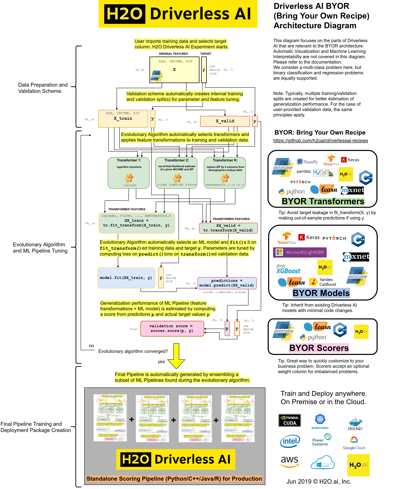

# H2O Driverless AI: Bring Your Own Recipes
## FAQ

### Why do I need to bring my own recipes?
Custom recipes can improve performance. Domain knowledge and intuition are essential for achieving optimal results.

### What are some example recipes?
See the [examples in this repository](https://github.com/h2oai/driverlessai-recipes/blob/master/README.md#sample-recipes). Examples include:

- **Transformer**:
  - Split string columns into multiple numeric columns (e.g., `"A:B:10:5"` becomes `[0,1,10,5]`).
  - **PyTorch** deep learning model for [text similarity analysis](https://github.com/h2oai/driverlessai-recipes/blob/master/transformers/nlp/text_embedding_similarity_transformers.py).
  - **ARIMA** model for [time-series forecasting](https://github.com/h2oai/driverlessai-recipes/blob/master/transformers/timeseries/auto_arima_forecast.py).
  - **Data augmentation**, like replacing zip codes with demographic info or using a [national holiday flag](https://github.com/h2oai/driverlessai-recipes/blob/master/transformers/augmentation/singapore_public_holidays.py).

- **Model**:
  - H2O-3 [algorithms](https://github.com/h2oai/driverlessai-recipes/blob/master/models/algorithms/h2o-3-models.py), including H2O AutoML.
  - **Yandex [CatBoost](https://github.com/h2oai/driverlessai-recipes/blob/master/models/algorithms/catboost.py)** gradient boosting.
  - Custom loss functions for [LightGBM](https://github.com/h2oai/driverlessai-recipes/blob/master/models/custom_loss/lightgbm_with_custom_loss.py) or [XGBoost](https://github.com/h2oai/driverlessai-recipes/blob/master/models/custom_loss/xgboost_with_custom_loss.py).

- **Scorer**:
  - Optimize for the [top decile](https://github.com/h2oai/driverlessai-recipes/blob/master/scorers/regression/top_decile.py) in regression tasks.
  - Improve the [false discovery rate](https://github.com/h2oai/driverlessai-recipes/blob/master/scorers/classification/binary/false_discovery_rate.py) for binary classification.

- **Explainer**:
  - Create custom recipes for model interpretability, fairness, robustness, and explanations.
  - Generate custom plots, charts, markdown reports, and more.

### Is H2O Driverless AI sufficient without custom recipes?
H2O Driverless AI continues to improve with each version, so you may not need custom recipes. However, adding your own recipes can optimize performance for specific use cases.

### What's in it for me if I write a recipe?
Writing recipes improves your data science skills and helps achieve better results. It is one of the best ways to enhance your expertise.

### Who can write recipes?
Anyone with the necessary expertise can contribute. Data scientists and developers typically write recipes, though even simple recipes can have a significant impact.

### What do I need to write a recipe?
A text editor and knowledge of Python. Recipes are written as `.py` files with the source code.

### How do I start?
- Review the [API specifications](https://github.com/h2oai/driverlessai-recipes#reference-guide) and architecture diagrams.
- Review the [examples in this repository](https://github.com/h2oai/driverlessai-recipes/blob/master/README.md#sample-recipes).
- Upload your recipe in the Expert Settings section during the experiment setup.

### What version of Python does H2O Driverless AI use?
H2O Driverless AI uses Python 3.11. Ensure your recipes are compatible with this version.

### How do I know if my recipe works?
H2O Driverless AI will notify you whether your recipe passes the acceptance tests. If it fails, feedback will guide you on how to fix it.

### How can I debug my recipe?
Upload your recipe to the Expert Settings and use the experiment log for debugging. Alternatively, make minimal changes as shown in [this debugging example](./transformers/how_to_debug_transformer.py) and debug with a Python debugger, like PyCharm.

### What happens if my recipe is rejected during upload?
Review the error message, which usually includes a stack trace and hints for fixing the issue. If you need help, ask questions in the [H2O Driverless AI community Slack channel](https://www.h2o.ai/community/driverless-ai-community/#chat). You can also send your experiment logs zip file, which will contain the recipe source files.

### What if my transformer recipe doesn't lead to the highest variable importance?
Features created by your transformer might not have the strongest signal, but they can still improve the overall model performance.

### What happens if my recipe is not used in the experiment?
H2O Driverless AI will use the best-performing recipes. Check the experiment logs for errors related to your recipe. You can also disable recipe failures in Expert Settings.

### Can I write recipes in Go, C++, Java, or R?
You can use any language as long as you can interface it with Python. Many recipes rely on Java and C++ backends.

### Is there a difference between custom recipes and those shipped with H2O Driverless AI?
Custom recipes are treated the same as built-in recipes. There is no performance penalty or calling overhead.

### Why are some models implemented as transformers?
The transformer API allows flexibility. For example, transformers can process specific input columns while leaving others unchanged, resulting in improved accuracy.

### How can I control which custom recipes are active? How can I disable all custom recipes?
Recipes can be disabled by setting `enable_custom_recipes=false` in the `config.toml` file or using the `DRIVERLESS_AI_ENABLE_CUSTOM_RECIPES=0` environment variable. To disable uploading new recipes, set `enable_custom_recipes_upload=false` or `DRIVERLESS_AI_ENABLE_CUSTOM_RECIPES_UPLOAD=0`.

### What if I keep changing the same recipe?
When you upload a new version of a recipe, it becomes the default. Older experiments will continue using the previous version.

### Who can see my recipe?
Anyone with access to the H2O Driverless AI instance can run any uploaded recipe, but recipes are shared only within the instance.

### How do I delete all recipes on my instance?
To delete all recipes, remove the `contrib` folder from the data directory (usually `tmp`) and restart H2O Driverless AI. This will prevent old experiments from making predictions unless related experiments are also deleted.

### Are MOJOs supported for experiments that use custom recipes?
In most cases, MOJOs are not available for custom recipes. Contact support@h2o.ai for more details.

### How do I share my recipe with the community?
Contribute to this repository by making a pull request. If your recipe works, it can help others optimize their experiments.

## References
### Custom Transformers
  * sklearn API
    * Implement `fit_transform(X, y)` for batch transformation of the training data
    * Implement `transform(X)` for row-by-row transformation of validation and test data
  * [Custom Transformer Recipe SDK/API Reference](transformers/transformer_template.py)
  * [Using datatable](https://datatable.readthedocs.io/en/latest/using-datatable.html)
### Custom Models
  * sklearn API
    * Implement `fit(X, y)` for batch training on the training data
    * Implement `predict(X)` for row-by-row predictions on validation and test data
  * [Custom Model Recipe SDK/API Reference](models/model_template.py)
### Custom Scorers
  * sklearn API
    * Implement `score(actual, predicted, sample_weight, labels)` for computing scores and metrics from predictions and actual values
  * [Custom Scorer Recipe SDK/API Reference](scorers/scorer_template.py)
### Custom Explainers
  * [BYOR MLI Custom Recipes](explainers)
### Technical Architecture Diagram
  * [Direct Link](https://raw.githubusercontent.com/h2oai/driverlessai-recipes/master/reference/DriverlessAI_BYOR.png)
  * [Source File](https://raw.githubusercontent.com/h2oai/driverlessai-recipes/master/reference/DriverlessAI_BYOR.drawio)
  
### Webinar
Webinar: [Extending the H2O Driverless AI Platform with Your Recipes](https://www.brighttalk.com/webcast/16463/360533/extending-the-h2o-driverless-ai-platform-with-your-recipes)
Website: [H2O Driverless AI Recipes](https://www.h2o.ai/products-h2o-driverless-ai-recipes/)