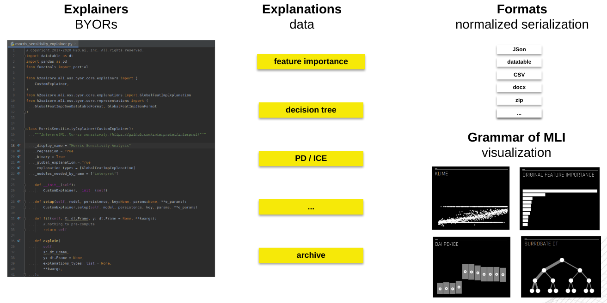
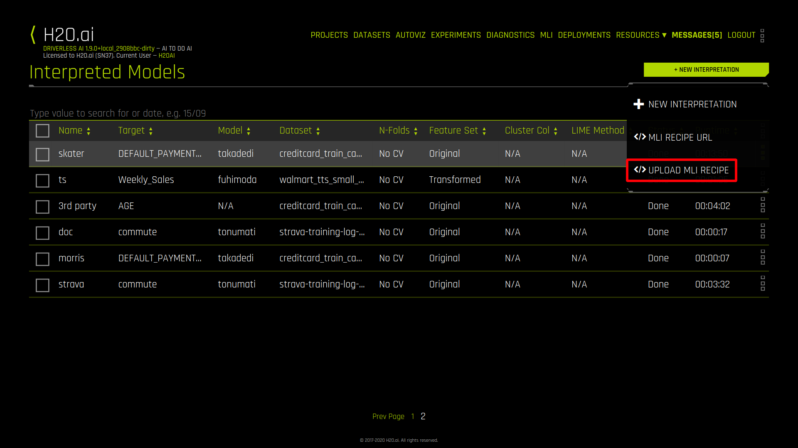
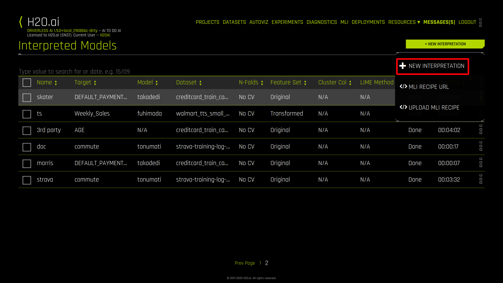
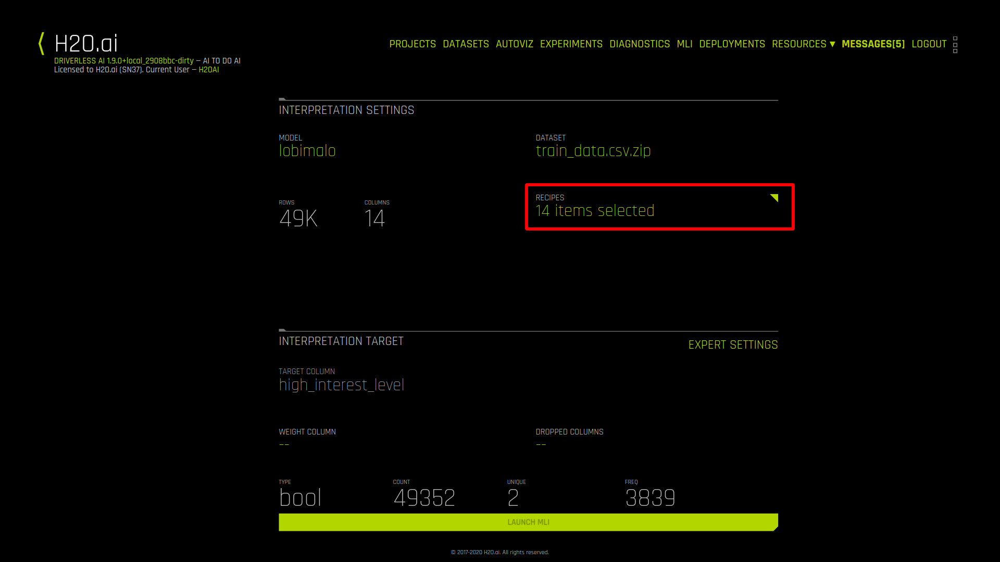
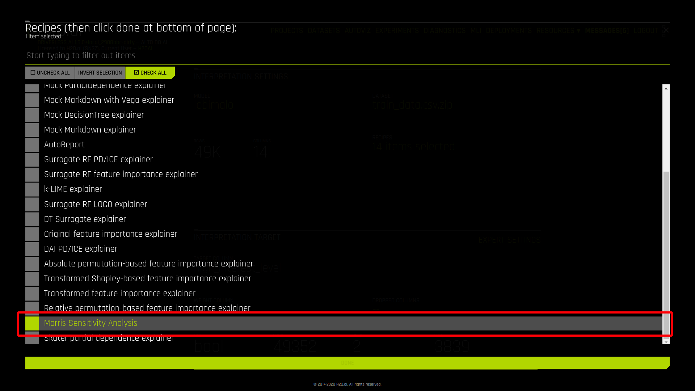
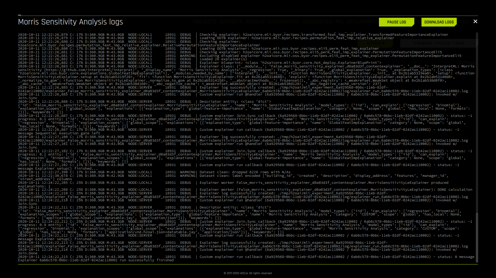

# Creating Custom Explainer with MLI BYORs
At H2O.ai, we believe that every company can and should be an AI company.

To make your own **explainable AI** platform, the platform needs to be open and **extensible**. This allows data scientists to control the automatic machine learning optimization process and ensure **fairness**,  **transparency** and **interpretability**. Data scientists can add their insights, customizations and domain expertise as custom explainers to build the models responsibly. 

MLI module of Driverless AI uses the concept of **recipes** so that users can add and develop **custom explainers**.

**Table of Contents**

* [Introduction to MLI Bring Your Own Recipes](#introduction-to-mli-bring-your-own-recipes)
    * [How do recipes work?](#how-do-recipes-work)
    * [What is the role of recipes?](#what-is-the-role-of-recipes)
    * [Where can you find open-source recipes?](#where-can-you-find-open-source-recipes)
* [Custom Explainer](#custom-explainer)
    * [Morris sensitivity analysis](#morris-sensitivity-analysis)
    * [Create](#create)
        * [Constructor](#constructor)
        * [setup()](#setup)
        * [fit()](#fit)
        * [explain()](#explain)
    * [Deploy](#deploy)
    * [Run](#run)
    * [Debug](#debug)
* [Conclusion](#conclusion)
* [Resources](#resources)
* [Morris sensitivity analysis explainer source code](#morris-sensitivity-analysis-explainer-source-code)
## Introduction to MLI Bring Your Own Recipes
H2O Driverless AI is an artificial intelligence (AI) platform for automatic machine learning.

Driverless AI provides robust **interpretability** of machine learning models to explain modeling results in a human-readable format. In the **Machine Learning Interpetability** (MLI) view, Driverless AI employs a host of different techniques and methodologies for interpreting and explaining the results of its models.

The set of techniques and methodologies can be **extended with recipes**. Driverless AI has support for **BYOR** (Bring Your Own Recipe). These recipes are **Python** code snippets. With BYOR, you can use your own recipes in combination with or instead of all built-in recipes. This allows you to further extend MLI explainers in addition to out-of-the-box techniques.

Custom explainer recipes can be uploaded into Driverless AI at runtime without having to restart the platform, just like a plugin. 
### How do recipes work?
When MLI user starts interpretation, model compatible explainers (from the available set of out-of-the-box and custom explainers) are selected and executed. Explainers create model explanations which are visualized in Driverless AI UI and/or can be downloaded:

1. explainer execution
1. explanation creation
1. optional explanation normalization
1. explanation visualization in UI and/or download
### What is the role of recipes?
BYOR allows Data Scientists to bring their **own recipes** or leverage the existing, **open-source** recipes to explain models. In this way, the expertise of those creating and using the recipes is leveraged to focus on domain-specific functions to build customizations.
### Where can you find open-source recipes?
The curated open-source recipes currently reside [explainers](https://github.com/h2oai/driverlessai-recipes/tree/rel-1.9.1/explainers/explainers) section of Driverless AI recipes GitHub repository:

* [Morris sensitivity analysis](https://github.com/h2oai/driverlessai-recipes/blob/rel-1.9.1/explainers/explainers/morris_sensitivity_explainer.py) explainer
* explainer [templates](https://github.com/h2oai/driverlessai-recipes/tree/rel-1.9.1/explainers/explainers/templates)

## Custom Explainer


This section describes how to implement a **custom explainer**.
### Morris sensitivity analysis
Explainer which will be created leverages [Morris sensitivity analysis](https://github.com/interpretml/interpret#supported-techniques) technique from 3rd-party Microsoft **open source** interpretation library InterpretML:

* [InterpretML](https://interpret.ml/)
* [interpretml/interpret GitHub repository](https://github.com/interpretml/interpret#supported-techniques) 

For full listing of the custom explainer please refer to [Morris sensitivity analysis explainer source code](#morris-sensitivity-analysis-explainer-source-code).
### Create
Custom explainer recipe is **Python class** whose parent class is `CustomExplainer`.

```
class MorrisSensitivityExplainer(CustomExplainer):
    ...
```

Explainer declares it's display name (shown in UI and API), supported experiments (regression, binomial, multinomial), explanations scope (global, local), explanations types, Python dependencies and other metadata as **class field**.

```
class MorrisSensitivityExplainer(CustomExplainer):

    _display_name = "Morris Sensitivity Analysis"
    _regression = True
    _binary = True
    _global_explanation = True
    _explanation_types = [GlobalFeatImpExplanation]
    _modules_needed_by_name = ["gevent==1.5.0", "interpret==0.1.20"]

    ...
```

Morris sensitivity analysis explainer will support global feature importance explanations for regression and binomial experiments and it depends on Microsoft `interpret` library (`pip` package name).

When implementing explainer, the following methods are invoked through the explainer **lifecycle**:

* `__init__()` ... **MUST** be implemented
    * Explainer class constructor which takes no parameters and calls parent constructor(s).
* `setup()` ... **MUST** be implemented
    * Explainer initialization which gets various arguments allowing to get ready for compatibility check and actual calculation.
* `check_compatibility() -> bool` ... **OPTIONAL**
    * Compatibility check which can be used to indicate that the explainer is not compatible with given model, dataset, parameters, etc.
* `fit()` ... **MUST** be implemented
    * Method which can pre-compute explainer artifacts like (surrogate) models to be subsequently used by explain methods. This method is invoked only once in the lifecycle of explainer.
* `explain() -> list` ... **MUST** be implemented
    * Method which creates and persists **global** and **local** explanations which can use artifacts prepared by `fit()`.
* `explain_local() -> list` ... **OPTIONAL**
    * Method which creates **local** explanations - it can be calculated on demand or use artifacts prepared by `fit()` and `explain()`.
* `destroy()` ... **OPTIONAL**
    * Post explainer explain method clean up.

These methods are invoked by recipe runtime through the explainer **lifecycle**.
#### Constructor
Explainer **must** implement default constructor which **cannot** have required parameters:

```
    def __init__(self):
        CustomExplainer.__init__(self)
```
#### setup()
Explainer must implement `setup()` method with the following signature:

```
    def setup(self, model, persistence, key=None, params=None, **e_params):
        """Set all the parameters needed to execute `fit()` and `explain()`.

        Parameters
        ----------
        model: Optional[ExplainerModel]
          DAI explainer model with (fit and) score methods (or `None` if 3rd party
          explanation).
        persistence: CustomExplainerPersistence
          Persistence API allowing (controlled) saving and loading of explanations.
        key: str
          Optional (given) explanation run key (generated otherwise).
        params: CommonExplainerParameters
          Common explainer parameters specified on explainer run.
        explainer_params:
          Explainer parameters, options and configuration.

        """

        CustomExplainer.setup(self, model, persistence, key, params, **e_params)
```

The implementation must invoke parent class `setup()` method which sets the following class instance attributes:

* `self.model`
   * Instance of `ExplainerModel` class which has **predict** and **fit** functions of the model to be explained.
* `self.persistence`
   * Instance of `CustomExplainerPersistence` class which provides custom explainer the way how to persist the data e.g. to its working directory.
* `self.params`
   * Common **explainers** parameters specified on explainer run like target column or columns to drop.
* `self.explainer_params`
   * This custom **explainer specific** parameters specified on explainer run.
* `self.logger`
   * Logger which can be used to print info, debug, warning, error or debug messages to explainer's log - to be used e.g. for debugging.
* `self.config`
   * Driverless AI configuration.

Instance attributes listed above can be subsequntly used in `fit()` and `explain()` methods.
#### fit()
Explainer must implement `fit()` method with the following signature:

```
    def run_fit(self, X, y=None, **kwargs):
        """Build explainer and explanation prerequisites.

        This is method invoked by custom explainer execution engine (can add code to
        be executed before/after `fit()` overridden by child classes).

        Parameters
        ----------
        X: Union[datatable.Frame, Any]
          Data frame.
        y: Optional[Union[datatable.Frame, Any]]
          Labels.

        """
        return self
```

Morris sensitivity analysis explainer doesn't have to precompute anything.
#### explain()
Finally custom explainer must implement `explain()` method which is supposed to **create** and **persist** both **global** and **local** explanations:

```
    def explain(self, X, y=None, explanations_types: list = None, **kwargs,
    ) -> list:
        ...
```

`explain()` method typically has the following steps:

1. **dataset** preparation
1. **predict method** creation
1. explanation **calculation**
1. optional explanation **normalization**

**Dataset** preparation will be skipped to keep this tutorial simple, however, please note that 3rd party Morris sensitivity analysis implementation works on datasets and models **with numerical features only** i.e. it **fails** on dataset with e.g. string categorical features.

If custom explainer uses a 3rd party library, it typically must create **predict method** which can be used by 3rd party library. In this case, Morris sensitivity analysis expects predict method output to be Pandas frame, therefore the default predict method (injected by `setup()` method and available as `self.model.predict_method`) must be customized:

```
        def predict_function(pred_fn, col_names, X):
            preds = pred_fn(pd.DataFrame(X.tolist(), columns=col_names))
            if isinstance(preds, pd.core.frame.DataFrame):
                preds = preds.to_numpy()
            if preds.ndim == 2:
                preds = preds.flatten()
            return preds

        predict_fn = partial(
            predict_function, self.model.predict_method, X.names
        )
```

`predict_fn` is predict method which is Morris sensitivity analysis compliant.

Explanation **calculation** is straighforward - Morris sensitivity analysis is imported and invoked:

```
        from interpret.blackbox import MorrisSensitivity

        sensitivity: MorrisSensitivity = MorrisSensitivity(
            predict_fn=predict_fn, data=X.to_pandas(), feature_names=X.names
        )
        morris_explanation = sensitivity.explain_global(name=self.display_name)
```

`morris_explanation` is a third party/proprietary explanation. Explainer can:

* persist explanation and make it available for **download**
* **optionally normalize** the explanation to enable interactive chart visualization in Driverless AI UI

Finally `explain()` method must return explanations declared by the custom explainer:

```
        explanations = [self._normalize_to_gom(morris_explanation)]
        return explanations
```

---


The purpose of **normalization** is to enable explanation **visualization** using interactive chart(s). MLI module of Driverless AI brings [Grammar of MLI](.) (GoM) which is a set of reusable charts which can be used in Driverless AI UI to visualize explanations. Morris sensitivity analysis explainer will use **feature importance** GoM component. This explains why data must be normalized - the component must understand the data (cannot work with unknown 3rd party formats).

Explanations are normalized as:

* **explanation types**
    * For instance: feature importance, decision tree, partial dependence, ...
* **explanation format**
    * Explanation type can have multiple formats which can be used to persist it e.g. CSV, JSon, datatable frame, ...

Morris sensitivity analysis explainer will use **global feature importance** explanation type persisted as `JSon+datatable` - JSon index file which references per-class `datatable` frame with importances.

**Normalization** of 3rd party explanation typically has the following steps:

* normalized **explanation** instantiation 
* **format** instantiation
    * data **normalization/conversion**
    * **index file** creation
    * **data file(s)** creation

Fortunately MLI recipes comes with **library of classes and functions for simple GoM normalization**.

Global feature importance explanation is created first:

```
    def _normalize_to_gom(self, morris_explanation) -> GlobalFeatImpExplanation:
        # EXPLANATION
        explanation = GlobalFeatImpExplanation(
            explainer=self,
            display_name=self.display_name,
            display_category=GlobalFeatImpExplanation.DISPLAY_CAT_CUSTOM,
        )
```

`JSon+datatable` format for global feature importnace explanation is created next:

```
        # FORMAT: JSon+datatable
        jdf = GlobalFeatImpJSonDatatableFormat
```

3rd-party frame format is converted to GoM frame format (documented in `representations.py` format docstring):

```
        # data normalization
        explanation_frame = dt.Frame(
            {
                jdf.COL_NAME: morris_explanation.data()["names"],
                jdf.COL_IMPORTANCE: list(morris_explanation.data()["scores"]),
                jdf.COL_GLOBAL_SCOPE: [True]
                * len(morris_explanation.data()["scores"]),
            }
        ).sort(-dt.f[jdf.COL_IMPORTANCE])
```

Format index file to reference per multinomial/binomial/... class data file:

```
        # index file (of per-class data files)
        (
            idx_dict,
            idx_str,
        ) = GlobalFeatImpJSonDatatableFormat.serialize_index_file(["global"])
        json_dt_format = GlobalFeatImpJSonDatatableFormat(explanation, idx_str)
        json_dt_format.update_index_file(
            idx_dict, total_rows=explanation_frame.shape[0]
        )
```

Data file is persisted by adding it to the format:

```
        # data file
        json_dt_format.add_data_frame(
            format_data=explanation_frame,
            file_name=idx_dict[jdf.KEY_FILES]["global"],
        )
```

Finally the format is added to the explanation:

```
        explanation.add_format(json_dt_format)
```

Once is created a format, it can be easily converted to other formats e.g. it's easy to get `JSon` format of global feature importance to provide alternative representation:

```
        # other formats (CSV, datatable, ...) available for free (transcoding) via GoM
        explanation.add_format(
            explanation_format=GlobalFeatImpJSonFormat.from_json_datatable(
                json_dt_format
            )
        )
```

Normalized explanation is returned:

```
        return explanation
```

Above code will create the following directory structure within the explainer filesystem sandbox - note global feature importance directory which contains `JSon` and `JSon+datatable` formats:

```
        explainer_morris_sensitivity_explainer_..._MorrisSensitivityExplainer_<UUID>
        ├── global_feature_importance
        │   ├── application_json
        │   │   ├── explanation.json
        │   │   └── feature_importance_class_0.json
        │   └── application_vnd_h2oai_json_datatable_jay
        │       ├── explanation.json
        │       └── feature_importance_class_0.jay
        ├── log
        │   ├── explainer_job.log
        │   └── logger.lock
        └── work
```

This concludes **custom explainer implementation**. For full explainer and `explain()` method listing please refer to [Morris sensitivity analysis explainer source code](#morris-sensitivity-analysis-explainer-source-code).
### Deploy
To deploy custom explainer created in the previous section from **UI**, open MLI homepage by clicking `MLI` tab:


Click `NEW INTERPRETATION` button and choose `UPLOAD MLI RECIPE` to upload recipe from your computer:



Custom recipe will be uploaded and it will be installed along with its dependencies.

---

Alternatively recipe can be uploaded using Driverless AI [Python client](http://docs.h2o.ai/driverless-ai/latest-stable/docs/userguide/python_install_client.html):

```
recipe:CustomRecipe = h2oai_client.upload_custom_recipe_sync(file_path)
```
### Run
To run custom explainer, click `NEW INTERPRETATION` button on MLI homepage: 



After new interpretation dialog opens, choose model, dataset and select explainer(s) you want to run:



To run Morris sensitivity analysis explainer only, uncheck all others, choose the explainer and click `DONE`:



When ready, click `LAUNCH MLI` to run the interpretation:


When Morris sensitivity explainer finishes, the number of `DONE` explainers in the upper right corner is set to `1`:


Click the explainer tile to see global feature importance explanation chart:


### Debug
To debug custom explainer, you can use `self.logger` instance attribute to log debugging messages. This messages are stored to explainer's log.

To get explainer log - with your, explainer runtime and explainer log items - from UI, click task manager `RUNNING | FAILED | DONE` button in the upper right corner of running enterpretation and hover over explainer's entry in the list of tasks:


Buttons allowing to abort the explainer and get its logs will appear.



Use log to determine root cause of the failure, fix it and simply re-deploy the custom explainer in the same way as it was deployed.
## Conclusion
In this tutorial you learned how to implement, deploy, run, debug and get explanations of MLI BYOR recipes.

Custom explainer implemented in this tutorial has various limitations like that it works wit cleaned (numerical features) datasets only. It could be further improved - to work with any dataset, to provide more explanations and representations.

Please refer to [MLI BYORs Developer Guide](CREATING_CUSTOM_EXPLAINER_WITH_MLI_BYOR.MLI_BYORS_DEVELOPER_GUIDE.md) to learn more about versioning, local explanations, Driverless AI model specific explainers and more.
## Resources
* [MLI documentation](https://docs.h2o.ai/driverless-ai/latest-stable/docs/userguide/interpreting.html)
* Presentation: [Responsible ML recipes](https://docs.google.com/presentation/d/1KwfzVnlKC42kxECeQFzUaEWzvYlYnZymyB9oxIKT0pI) 
* Tutorial: [Driverless AI autoML recipes](https://github.com/h2oai/tutorials/blob/1.8.7.1/Driverless%20AI/get-started-with-open-source-custom-recipes-tutorial/get-started-with-open-source-custom-recipes-tutorial.md)
## Morris sensitivity analysis explainer source code
```
from functools import partial

import datatable as dt
import pandas as pd

from h2oaicore.mli.oss.byor.core.explainers import CustomExplainer
from h2oaicore.mli.oss.byor.core.explanations import GlobalFeatImpExplanation
from h2oaicore.mli.oss.byor.core.representations import (
    GlobalFeatImpJSonDatatableFormat,
    GlobalFeatImpJSonFormat,
)


class MorrisSensitivityExplainer(CustomExplainer):
    """InterpretML: Morris sensitivity (https://github.com/interpretml/interpret)"""

    _display_name = "Morris Sensitivity Analysis"
    _regression = True
    _binary = True
    _global_explanation = True
    _explanation_types = [GlobalFeatImpExplanation]
    _modules_needed_by_name = ["gevent==1.5.0", "interpret==0.1.20"]

    def __init__(self):
        CustomExplainer.__init__(self)

    def setup(self, model, persistence, key=None, params=None, **e_params):
        CustomExplainer.setup(self, model, persistence, key, params, **e_params)

    def fit(self, X, y=None, **kwargs):
        # nothing to pre-compute
        return self

    def explain(self, X, y=None, explanations_types: list = None, **kwargs,
    ) -> list:
        from interpret.blackbox import MorrisSensitivity

        # PREDICT FUNCTION: Driverless AI scorer -> library compliant predict function
        def predict_function(pred_fn, col_names, X):
            preds = pred_fn(pd.DataFrame(X.tolist(), columns=col_names))
            if isinstance(preds, pd.core.frame.DataFrame):
                preds = preds.to_numpy()
            if preds.ndim == 2:
                preds = preds.flatten()
            return preds

        predict_fn = partial(
            predict_function, self.model.predict_method, X.names
        )

        # Morris explanation CALCULATION
        sensitivity: MorrisSensitivity = MorrisSensitivity(
            predict_fn=predict_fn, data=X.to_pandas(), feature_names=X.names
        )
        morris_explanation = sensitivity.explain_global(name=self.display_name)

        # Morris data NORMALIZATION to explanation w/ Grammar of MLI format
        explanations = [self._normalize_to_gom(morris_explanation)]
        return explanations

    def _normalize_to_gom(self, morris_explanation) -> GlobalFeatImpExplanation:
        # EXPLANATION
        explanation = GlobalFeatImpExplanation(
            explainer=self,
            display_name=self.display_name,
            display_category=GlobalFeatImpExplanation.DISPLAY_CAT_CUSTOM,
        )

        # FORMAT: JSon+datatable
        jdf = GlobalFeatImpJSonDatatableFormat
        # data normalization
        explanation_frame = dt.Frame(
            {
                jdf.COL_NAME: morris_explanation.data()["names"],
                jdf.COL_IMPORTANCE: list(morris_explanation.data()["scores"]),
                jdf.COL_GLOBAL_SCOPE: [True]
                * len(morris_explanation.data()["scores"]),
            }
        ).sort(-dt.f[jdf.COL_IMPORTANCE])
        # index file (of per-class data files)
        (
            idx_dict,
            idx_str,
        ) = GlobalFeatImpJSonDatatableFormat.serialize_index_file(["global"])
        json_dt_format = GlobalFeatImpJSonDatatableFormat(explanation, idx_str)
        json_dt_format.update_index_file(
            idx_dict, total_rows=explanation_frame.shape[0]
        )
        # data file
        json_dt_format.add_data_frame(
            format_data=explanation_frame,
            file_name=idx_dict[jdf.KEY_FILES]["global"],
        )
        explanation.add_format(json_dt_format)

        # other formats (CSV, datatable, ...) available for free (transcoding) via GoM
        explanation.add_format(
            explanation_format=GlobalFeatImpJSonFormat.from_json_datatable(
                json_dt_format
            )
        )

        return explanation
```
