# MLI BYORs Developer Guide
At [H2O.ai](https://www.h2o.ai/), we believe that every company can and should be an AI company.

To make your own **explainable AI** platform, the platform needs to be open and **extensible**. This allows data scientists to control the automatic machine learning optimization process and ensure **fairness**,  **transparency** and **interpretability**. Data scientists can add their insights, customizations and domain expertise as custom explainers to build the models responsibly. 

MLI module of Driverless AI uses the concept of **recipes** so that users can add and develop **custom explainers**.

**Table of Contents**

* [Introduction to MLI Bring Your Own Recipes](#introduction-to-mli-bring-your-own-recipes)
    * [How do recipes work?](#how-do-recipes-work)
    * [What is the role of recipes?](#what-is-the-role-of-recipes)
* [Explainable Models and Explainers](#explainable-models-and-explainers)
* [Custom Explainer](#custom-explainer)
    * [Create](#create)
        * [Runtimes](#runtimes)
        * [Explainers, Explanations and Formats](#explainers--explanations-and-formats)
            * [CustomExplainer](#customexplainer)
            * [CustomDaiExplainer](#customdaiexplainer)
            * [CustomExplanation](#customexplanation)
            * [CustomExplanationFormat](#customexplanationformat)
        * [Metadata](#metadata)
            * [Parameters](#parameters)
        * [Constructor](#constructor)
        * [check_compatibility()](#check-compatibility)
        * [setup()](#setup)
        * [fit()](#fit)
        * [explain()](#explain)
            * [Dataset Preparation](#dataset-preparation)
            * [Predict Method](#predict-method)
            * [Persistence](#persistence)
            * [Explanation Calculation and Persistence](#explanation-calculation-and-persistence)
            * [Normalization](#normalization)
        * [explain_local()](#explain-local)
            * [Cached Local Explanation](#cached-local-explanation)
            * [On-demand Local Explanation](#on-demand-local-explanation)
        * [explain_global()](#explain-global)
        * [destroy()](#destroy)
    * [Deploy](#deploy)
    * [List and Filter](#list-and-filter)
    * [Run](#run)
    * [Debug](#debug)
    * [Get](#get)
        * [Explanations Introspection](#explanations-introspection)
        * [Explanations](#explanations)
        * [Snapshots](#snapshots)
    * [Visualize](#visualize)
        * [Grammar of MLI](#grammar-of-mli)
            * [Feature Importance](#feature-importance)
            * [PD/ICE](#pd-ice)
            * [Markdown](#markdown)
            * [Decision Tree](#decision-tree)
            * [Scatter Plot](#scatter-plot)
* [Best Practices](#best-practices)
    * [Performance](#performance)
    * [Safety](#safety)
    * [Security](#security)
    * [Versioning](#versioning)
* [Explainer Examples](#explainer-examples)
    * [Hello world!](#hello-world)
    * [Logging Example](#logging-example)
    * [EDA Example](#eda-example)
    * [Score Example](#score-example)
    * [Parameters Example](#parameters-example)
    * [Compatibility Example](#compatibility-example)
    * [Persistence Example](#persistence-example)
    * [Custom Explanation Example](#custom-explanation-example)
    * [DAI Explainer Metadata Example](#dai-explainer-metadata-example)
    * [Morris SA example](#morris-sa-example)
    * [Explainer Templates](#explainer-templates)
* [Appendices](#appendices)
    * [Explainer Python API](#explainer-python-api)
    * [Python Client API Jupyter Notebook](#python-client-api-jupyter-notebook)
    * [Python Client API reference](#python-client-api-reference)
    * [Driverless AI Configuration](#driverless-ai-configuration)
* [Resources](#resources)
# Introduction to MLI Bring Your Own Recipes
[H2O Driverless AI](https://www.h2o.ai/products/h2o-driverless-ai/) is an artificial intelligence (AI) platform for automatic machine learning.

Driverless AI provides robust **interpretability** of machine learning models to explain modeling results in a human-readable format. In the **Machine Learning Interpretability** (MLI) view, Driverless AI employs a host of different techniques and methodologies for interpreting and explaining the results of its models.

The set of techniques and methodologies can be **extended with recipes**. Driverless AI has support for **BYOR** (Bring Your Own Recipe). These recipes are **Python** code snippets. With BYOR, you can use your own recipes in combination with or instead of all built-in recipes. This allows you to further extend MLI explainers in addition to out-of-the-box techniques.

**Custom explainer recipes** can be uploaded into Driverless AI at runtime without having to restart the platform, just like a plugin. 
## How do recipes work?
When MLI user starts interpretation, model compatible explainers (from the available set of out-of-the-box and custom explainers) are selected and executed. Explainers create model explanations which are visualized in Driverless AI UI and/or can be downloaded:

1. explainer execution
1. explanation creation
1. optional explanation normalization
1. explanation visualization in UI and/or download
## What is the role of recipes?
BYOR allows Data Scientists to bring their **own recipes** or leverage the existing, **open-source** recipes to explain models. In this way, the expertise of those creating and using the recipes is leveraged to focus on domain-specific functions to build customizations.
# Explainable Models and Explainers
MLI BYORs in Driverless AI are of two main types:

* **explainable models**
    * Driverless AI interpretable / glass box **model recipes** like XNN.
* **model explainers**
    * MLI **explainer recipes** used for _post hoc_ model analysis.

This guide elaborates **model explainers**.

# Custom Explainer
Say hello to custom explainers with **your first explainer**:

```python
from h2oaicore.mli.oss.byor.core.explainers import (
    CustomExplainer,
)
from h2oaicore.mli.oss.byor.core.explanations import WorkDirArchiveExplanation


class ExampleHelloWorldExplainer(CustomExplainer):

    _display_name = "Hello, World!"
    _description = "This is 'Hello, World!' explainer example."
    _regression = True
    _explanation_types = [WorkDirArchiveExplanation]

    def __init__(self):
        CustomExplainer.__init__(self)

    def explain(self, X, y=None, explanations_types=None, **kwargs) -> list:
        explanation = self.create_explanation_workdir_archive(
            display_name=self.display_name, display_category="Demo"
        )

        return [explanation]
```

If you want try `Hello, World!` explainer now, please refer to [Hello world!](#hello-world) section.

Find **more examples** of simple explainers in [Explainer Examples](#explainer-examples) section:

* [Logging Example](#logging-example)
* [EDA Example](#eda-example)
* [Score Example](#score-example)
* [Parameters Example](#parameters-example)
* [Compatibility Example](#compatibility-example)
* [Morris SA example](#morris-sa-example)
* [Explainer Templates](#explainer-templates)
* ...

This section describes how to create, deploy, run, debug and get results of custom 
explainers in **detail**. It is **structured** according to custom explainer **life-cycle** shown by activity 
diagram below:

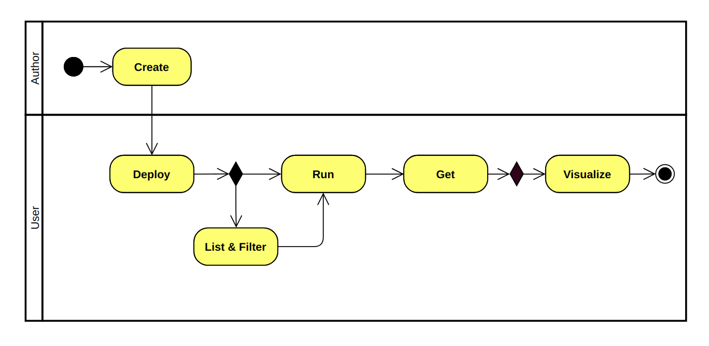

Also you may want to check [Creating Custom Explainer with MLI BYORs](CREATING_CUSTOM_EXPLAINER_WITH_MLI_BYOR.md)
tutorial if you want to get started with custom explainers quickly.
## Create
Custom explainer recipe is **Python class** whose parent class is `CustomExplainer`.

```python
class MyExplainer(CustomExplainer):
    ...
```
### Runtimes
MLI BYORs interfaces anticipate that instances of classes implementing 
custom explainer **interfaces** can run in different 
**explainer container runtimes**.

* **Driverless AI** is **the first** available MLI BYORs container runtime.
* **Local** (standalone) or **cloud** MLI BYORs container runtime might be provided in the future.

Custom explainers can be defined/implemented as:

* **runtime independent**
    - such explainers are based on [CustomExplainer](#customexplainer) and will run in **any** MLI BYORs container runtime
* **runtime aware** 
    - such explainers will run in a **specific** MLI BYORs container runtime only 

For example **Driverless AI** MLI BYOR container explainers are based on [CustomDaiExplainer](#customdaiexplainer)  
(in addition to [CustomExplainer](#customexplainer)) to get access to Driverless AI specific APIs, artifacts and data
structures.
### Explainers, Explanations and Formats
MLI BYORs define **3** important **concepts**:

* **explainer**
    - executable code which implements custom explainer interface
* **explanation**
    - model explanation created by explainer (like feature importance)
* **format**
    - a representation of model explanation in a normalized format (like JSon file with model feature importances)

**Explainer** creates **explanations** which are persisted in various normalized **formats**. 

Diagram below shows explainers, explanations and (normalized) formats which can be used to **render** representations
in Driverless AI using [Grammar of MLI](#grammar-of-mli) UI components.

---

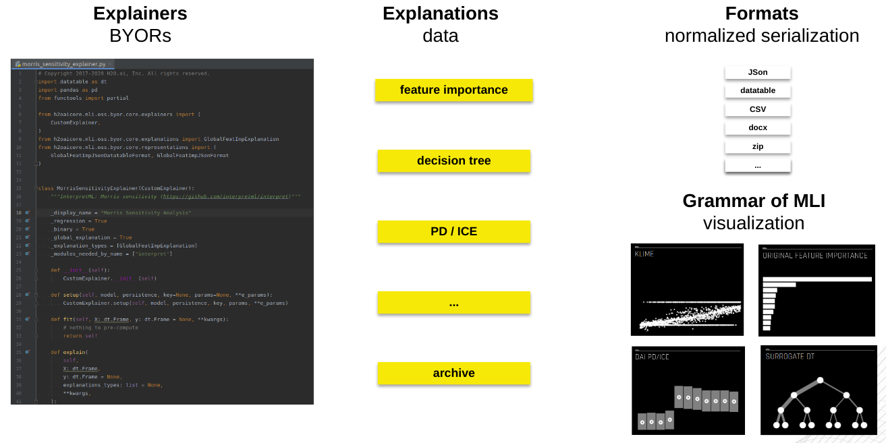

---

Explainer must create at least one explanation. Explanation must have at least one format.

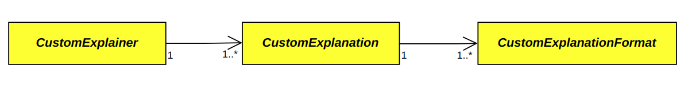

**Python** base classes for explainers, explanations and formats are defined as follows:

* Explainer: `CustomExplainer`
    * Explanation type: `CustomExplanation+`
        * Representation: `CustomExplanationFormat+`
            * MIME: `application/json`, `text/csv`, `application/zip`, ...

#### CustomExplainer
Custom explainers **must** inherit from the `CustomExplainer` class which declares:

* explainer **capabilities and attributes** as [Metadata](#metadata)
* **methods** which are invoked by custom explainers [Runtime](#runtimes)

<!-- 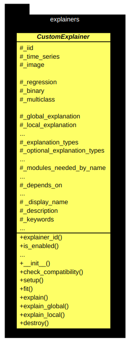 -->

`CustomExplainer` defines the following instance attributes:

* `self.model`
* `self.persistence`
* `self.params`
* `self.explainer_params`
* `self.logger`
* `self.config`

These instance attributes are set by `setup()` method and can be subsequently accessed using `self` to create explanations. 

* Check [setup()](#setup) section for instance attributes **documentation**.
* Check [Run](#run) section to determine order of method invocations  on RPC API procedures dispatch.

The following methods are invoked through the explainer **lifecycle**:

* [`__init__()`](#constructor) ... **MUST** be implemented
    * Explainer class constructor which takes no parameters and calls parent constructor(s).
* [`check_compatibility() -> bool`](check_compatibility) ... **OPTIONAL**
    * Compatibility check which can be used to indicate that the explainer is not compatible with given model, dataset, parameters, etc.
* [`setup()`](#setup) ... **MUST** be implemented
    * Explainer initialization which gets various arguments allowing to get ready for compatibility check and actual calculation.
* [`fit()`](#fit) ... **MUST** be implemented
    * Method which can pre-compute explainer artifacts like (surrogate) models to be subsequently used by explain methods. This method is invoked only once in the lifecycle of explainer.
* [`explain() -> list`](#explain) ... **MUST** be implemented
    * Method which creates and persists **global** and **local** explanations which can use artifacts prepared by `fit()`.
* [`explain_global() -> list`](#explain_global) ... **OPTIONAL**
    * Method which can (re)create **global** explanations - it can be calculated on demand or use artifacts prepared by `fit()` and `explain()`.
* [`explain_local() -> list`](#explain_local) ... **OPTIONAL**
    * Method which creates **local** explanations - it can be calculated on demand or use artifacts prepared by `fit()` and `explain()`.
* [`destroy()`](#destroy) ... **OPTIONAL**
    * Post explainer explain method clean up.

These methods are invoked by recipe runtime through the explainer **lifecycle**.

**Examples:** check [Explainer Examples](#explainer-examples) section for 
examples of custom explainers methods and attributes use.
#### CustomDaiExplainer
Custom explainers which need to use **Driverless AI** specific runtime container are based on [CustomDaiExplainer](#customdaiexplainer) class  
(in addition to [CustomExplainer](#customexplainer) class) to get access to Driverless AI **APIs**, **artifacts** and **data structures** (see [Runtimes](#runtimes) for more details).

Such custom explainer is typically defined as follows:

```python
class MyExplainer(CustomExplainer, CustomDaiExplainer):

    ...

    def __init__(self):
        CustomExplainer.__init__(self)
        CustomDaiExplainer.__init__(self)
        ...

    ...


    def setup(self, model, persistence, key=None, params=None, **e_params):
        CustomExplainer.setup(self, model, persistence, key, params, **e_params)
        CustomDaiExplainer.setup(self, **e_params)
        ...

    ...
```

Driverless AI custom explainer invokes `CustomDaiExplainer` parent class **constructor** and `setup()`
method to properly **initialize**. `CustomDaiExplainer` defines the following instance attributes:


* `self.mli_key`
* `self.dai_params`
* `self.dai_version`
* `self.dai_username`
* `self.explainer_deps`
* `self.model_entity`
* `self.dataset_entity`
* `self.validset_entity`
* `self.testset_entity`
* `self.mli_keyconfig`
* `self.sanitization_map`
* `self.labels`
* `self.num_labels`
* `self.used_features`
* `self.enable_mojo`

These instance attributes are set by `setup()` method and can be subsequently accessed using `self` to create explanations. 

* **Examples:** check [DAI explainer metadata example](#dai-explainer-metadata-example) and [DAI explainer example](#dai-explainer-example) simple custom explainer.
* Check [setup()](#setup) section for instance attributes documentation.
* Refer to [Explainer Python API](#explainer-python-api) reference for the documentation. 
#### CustomExplanation
Custom explainer creates [explanations](#explainers--explanations-and-formats).
Explanations represent **what** was computed to explain the model.

Explanations are instances of classes which inherit from `CustomExplanation` 
abstract class. MLI BYORs bring **pre-defined** set of classes for the most 
common explanations like:

* `WorkDirArchiveExplanation`
   * Working directory archive explanation can be used to provide `.zip`, `.tgz` or other type or archive
     with artifacts created by explainer in its working directory.
* `GlobalFeatureImportranceExplanation`
   * Global feature importance explanation can be used for explanations describing global importance
     of model features.
* `GlobalDtExplanation`
   * Global DT explanation can be used for explanations providing "glass box" decision tree associated
     with given model.
* `PartialDependenceExplanation`
   * Partial dependence explanation can be used for explanations clarifying interaction of model features
     and predictions.
* ...
* `LocalFeatureImportranceExplanation`
   * Local feature importance explanation can be used for explanations describing global importance
     of model features in case of particular dataset row.
* `LocalDtExplanation`
   * Local DT explanation can be used for explanations providing "glass box" decision tree **path**
     in the tree in case of particular dataset row.
* `InvididualConditionalExplanation`
   * ICE explanation can be used for explanations clarifying interaction of model features
     and predictions in case of particular dataset row
* ...

Explanation has:

* **scope** - either **global** (model/whole dataset) or **local** (particular dataset row)
* at least one **format** (representation) instance
* tile and tab **display names** which are used in UI

In order to understand **how are explanations stored** please refer to [Explanations Introspection](#explanations-introspection)
**before reading** the rest of this section.

Explanation instantiation example:

```python
# create global feature importance explanation
global_featimp_explanation = GlobalFeatImpExplanation(
    explainer=self,
    # display name used in UI as tile name
    display_name=self.display_name,
    # category name used in UI as tab name (tiles pane)
    display_category=GlobalFeatImpExplanation.DISPLAY_CAT_NLP,
)

# add JSon format ... feature importance can be downloaded as JSon file
...
global_featimp_explanation.add_format(
    explanation_format=json_dt_representation
)

# add CSV format ... feature importance can be downloaded as CSV file
global_featimp_explanation.add_format(
    explanation_format=GlobalFeatImpJSonCsvFormat.from_json_datatable(
        json_dt_representation
    )
)

# add datatable format ... feature importance can be downloaded as datatable frame file
global_featimp_explanation.add_format(
    explanation_format=GlobalFeatImpJSonFormat.from_json_datatable(
        json_dt_representation
    )
)
```

Initial set of explanation types is **extensible** - new explanations can be easily 
added just by creating a new class which inherits from `CustomExplanation`:

```
class MyCustomExplanation(CustomExplanation):
    """Example of a user defined explanation type."""

    _explanation_type = "user-guide-explanation-example"
    _is_global = True

    def __init__(
        self, explainer, display_name: str = None, display_category: str = None
    ) -> None:
        CustomExplanation.__init__(
            self,
            explainer=explainer,
            display_name=display_name,
            display_category=display_category,
        )

    def validate(self) -> bool:
        return self._formats is not None
```

Such custom explanations might be **deployed** along with explainers which use them.

**Example:** check [Custom Explanation Example](#custom-explanation-example) explainer.

#### CustomExplanationFormat
Explanation **representations** are actual (downloadable) artifacts (typically files) created 
by [explainers](#explainers--explanations-and-formats) as [explanations](#customexplanation). 

Explanation representations can be stored in various **formats** 
whose structure is identified by [MIME types](https://tools.ietf.org/html/rfc6838).
Explanation representations are instances of classes which inherit
from `CustomExplanationFormat` abstract class.

MLI BYORs bring pre-defined set of classes for the most common formats allowing to **persist** explanations like:

* `WorkDirArchiveZipFormat`
   * Zip archive representation of `WorkDirArchiveExplanation`.
* `GlobalFeatImpJSonFormat`
   * JSon representation of global feature importance explanation `GlobalFeatureImportranceExplanation`.
* `GlobalFeatImpDatatableFormat`
   * `datatable` frame representation of global feature importance explanation `GlobalFeatureImportranceExplanation`.
* `PartialDependenceJSonFormat`
   * JSon representation of partial dependence explanation `PartialDependenceExplanation`.
* ...
* `LocalDtJSonFormat`
   * JSon representation of local decision tree explanation i.e. **path** in the tree in case of particular dataset row.
* ...

Representations which can be **rendered by Driverless AI Grammar of MLI UI components** can 
be easily recognized as they inherit from `GrammarOfMliFormat`: 

```python
class PartialDependenceJSonFormat(
    TextCustomExplanationFormat, GrammarOfMliFormat
):
   mime = MimeType.MIME_JSON

   ...
```

Representation...

* has **format specification** using MIME type
* is formed by 
    * required **main or index file**
    * optional **data files(s)**
* main/index file and data files can be **normalized**
  to format specified by [Grammar of MLI](#grammar-of-mli)
  so that it can be shown in Driverless AI UI
* expected representations format is documented by
  [Explainer Python API](#explainer-python-api)

Representations are either formed by **one file** or **multiple files**
depending on the the explanation structure and/or experiment type. For example 
in case of **multinomial** explanation there is typically per-class data file 
and all data files are referenced from the index file.

Filesystem example of a simple text representation formed by **one file** (`explanation.txt`):

```
explainer_..._Example...Explainer_<UUID>
.
├── global_user_guide_explanation_example
│   ├── text_plain
│   │   └── explanation.txt
│   └── text_plain.meta
├── log
│   └── ...
└── work
    └── ...
```

Filesystem example of three representations formed by JSon index files which 
are referencing **per-class data files** in different formats (JSon, CSV, `datatable`):

```
.
├── global_feature_importance
│   ├── application_json
│   │   ├── explanation.json
│   │   ├── feature_importance_class_0.json
│   │   └── feature_importance_class_1.json
│   ├── application_vnd_h2oai_json_csv
│   │   ├── explanation.json
│   │   ├── feature_importance_class_0.csv
│   │   └── feature_importance_class_1.csv
│   ├── application_vnd_h2oai_json_datatable_jay
│   │   ├── explanation.json
│   │   ├── feature_importance_class_0.jay
│   │   └── feature_importance_class_1.jay
│   └── ...
├── log
│   └── ...
└── work
    └── ...
```

File `explanation.json` is index file which is referencing data 
files e.g. `feature_importance_class_0.csv` and `feature_importance_class_1.csv`
in case of JSon/CSV representation index file looks like:

```json
{
    "files": {
        "0": "feature_importance_class_0.csv",
        "1": "feature_importance_class_1.csv"
    },
    "metrics": [],
    "documentation": "NLP LOCO plot applies ...",
    "total_rows": 20
}
```

See also [Explanations Introspection](#explanations-introspection) section for **more details** on
representations persistence.

Representation instantiation example:

```
# index file 

(
    index_dict,
    index_str,
) = PartialDependenceJSonFormat.serialize_index_file(
    features=self.features,
    classes=["class_A", "class_B", "class_C"],
    features_meta={"categorical": [self.features[0]]},
    metrics=[{"RMSE": 0.029}, {"SD": 3.1}],
    doc=TemplatePartialDependenceExplainer._description,
)

# representation

json_representation = PartialDependenceJSonFormat(
    explanation=global_explanation, json_data=index_str
)

# data files: per-feature, per-class (saved as added to format)

for fi, feature in enumerate(self.features):
    for ci, clazz in enumerate(
        TemplatePartialDependenceExplainer.MOCK_CLASSES
    ):
        json_representation.add_data(
            # IMPROVE: tweak values for every class (1 data for simplicity)
            format_data=json.dumps(
                TemplatePartialDependenceExplainer.JSON_FORMAT_DATA
            ),
            # filename must fit the name from index file ^
            file_name=f"pd_feature_{fi}_class_{ci}.json",
        )

...
```

Initial set of representation types is **extensible** - new representation formats can be easily 
added just by creating a new class which inherits from `CustomExplanationFormat`.

```python
class GitHubMarkdownFlavorFormat(CustomExplanationFormat, GrammarOfMliFormat):
    """GitHub Markdown representation with text and images."""

    mime = MimeType.MIME_MARKDOWN

    def __init__(
        self,
        explanation,
        format_file: str,
        extra_format_files: Optional[List] = None,
    ):
        CustomExplanationFormat.__init__(
            self,
            explanation=explanation,
            format_data=None,
            format_file=format_file,
            extra_format_files=extra_format_files,
            file_extension=MimeType.ext_for_mime(self.mime),
        )

    @staticmethod
    def validate_data(dt_data: dt.Frame):
        return dt_data
```

Such custom representations might be **deployed** along with explainers which 
use them. In case that their **MIME type** will be supported by [Grammar of MLI](#grammar-of-mli)
they will be also rendered in Driverless AI UI.
### Metadata
Custom explainer declares its capabilities and attributes in its **metadata** section
as **class attributes**:

```python
class MyExplainer(CustomExplainer):

    _display_name = "My Explainer"
    _regression = True
    _binary = True
    _global_explanation = True
    _explanation_types = [GlobalFeatImpExplanation]

    ...
```

The most important metadata class attributes:

* **basic**
   * `_display_name: str`
       * recipe display name (used in UI, listings and instances)
   * `_description: str`
       * recipe description (used in UI, listings and instances)
   * `_keywords: List[str]`
       * list of recipe keywords used for recipes filtering and categorization
* **data**:
   * `_iid: bool`
       * specifies whether recipe can explain **IID** models
   * `_time_series`
       * specifies whether recipe can explain **time series** models
   * `_image`
       * specifies whether recipe can explain **image** modela
* **problem type**:
   * `_regression: bool`
       * recipe can explain regression problem types (`y` is of numeric type)
   * `_binary: bool`
       * recipe can explain binomial classification problem types (`y` can be of numeric or string type, cardinality 2)
   * `_multiclass: bool`
       * recipe can explain binomial classification problem types (`y` can be of numeric or string type, cardinality 3 or more)
* **scope**:
   * `_global_explanation: bool`
       * recipe can provide global explanations (like PD)
   * `_local_explanation: bool`
       * recipe can provide local explanations (like ICE)
* **explanations**
   * `_explanation_types: List[Type[CustomExplanation]]`
       * recipe always creates (must) these explanation types (at least one, for example 
         `[GlobalFeatImpExplanation, PartialDependenceExplanation]`)
   * `_optional_explanation_types: List[Type[CustomExplanation]]`
       * recipe may also create these explanation types (0 or more)
* **parameters**
   * `_parameters: List[CustomExplainerParam]`
       * list of (0 or more) recipe parameters
* **standalone**
   * `_requires_predict_method: bool`
       * recipe explains Driverless AI models (False) or standalone (3rd party model) - standalone 
         explanation requires dataset column with 3rd party model predictions
* **dependencies**
   * `_modules_needed_by_name: List[str]`
       * recipe requires Python package dependencies (which can be installed using `pipe`),
         for example `["mypackage==1.3.37"]`
   * `_depends_on: List[Type["CustomExplainer"]]`
       * recipe depends on other recipes - recipe dependencies are automatically added to
         interpretation execution plan and executed before the recipe so that its artifacts can be used
   * `_priority: float`
       * recipe priority in execution (high priority executed first)

Please refer to the [Explainer Python API](#explainer-python-api) documentation for full reference.
#### Parameters
Custom explainer can be parametrized and parameters
easily resolved using MLI BYOR library functions.

Parameter (name, description, type and default value) **declaration**:

```python
class ExampleParamsExplainer(...):

    PARAM_ROWS_TO_SCORE = "rows_to_score"

    _display_name = "Example Params Explainer"
    ...
    _parameters = [
        CustomExplainerParam(
            param_name=PARAM_ROWS_TO_SCORE,
            description="The number of dataset rows to be scored by explainer.",
            param_type=ExplainerParamType.int,
            default_value=1,
            src=CustomExplainerParam.SRC_EXPLAINER_PARAMS,
        ),
    ]
```

Parameter **types**:

```python
class ExplainerParamType(Enum):
    bool
    int
    float
    str
    list  # selection from predefined list of items
    multilist  # multiselection from predefined list of items
    customlist  # list of user strings, without predefined values
    dict = auto()
```

Argument values of declared parameters can be specified in **UI** when you [Run](#run) explainer(s) from selection listing:

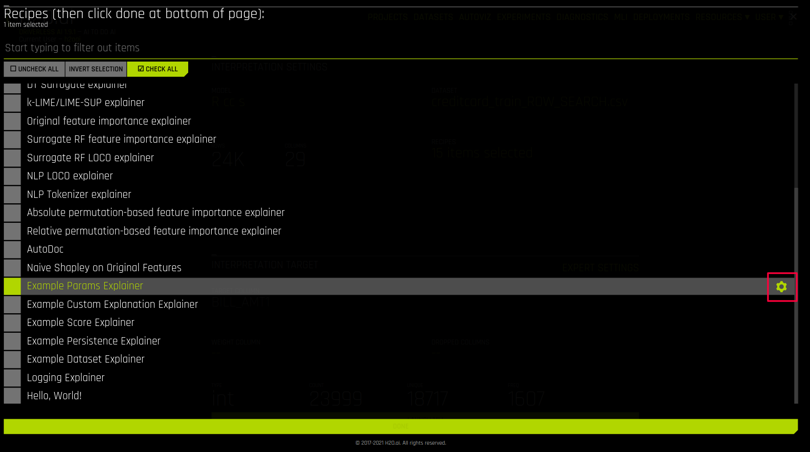

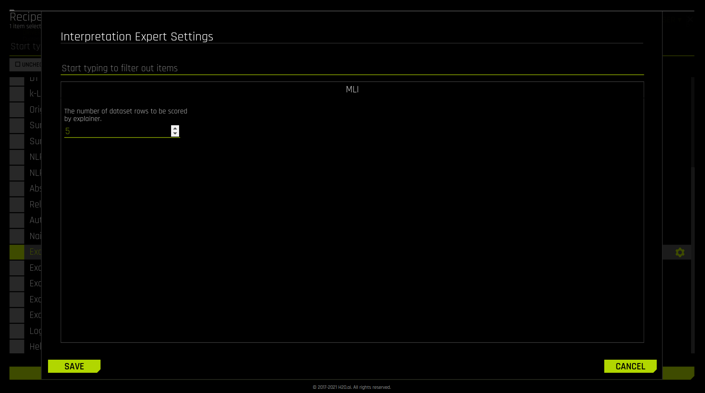

.. as well as when running the explainer using [Python Client API](#python-client-api-reference):

```python
explainer_id="...ExampleParamsExplainer"

explainer_params={"rows_to_score": 3}

job = h2oai_client.run_explainers(
    explainers=[Explainer(
        explainer_id=explainer_id,
        explainer_params=str(explainer_params),
    )],
    params=explainers_params,
)
```

[Python Client API](#python-client-api-reference) can be used to determine explainer's 
parameters - check [List and Filter](#list-and-filter) section:

```python
explainers = [explainer.dump() for explainer in h2oai_client.list_explainers(
        experiment_types=None, 
        explanation_scopes=None,
        dai_model_key=None,
        keywords=None,
        explainer_filter=[]
)]

...

Found 12 explainers
    h2oaicore.mli.byor.recipes.sa_explainer.SaExplainer
        ...
        parameters []
    h2oaicore.mli.byor.recipes.dai_pd_ice_explainer.DaiPdIceExplainer
        ...
        parameters [
            {'name': 'features', 
             'description': 'List of features for which to compute PD/ICE.', 
             'comment': '', 
             'type': 'multilist', 
             'val': None, 
             'predefined': [], 
             'tags': ['SOURCE_DATASET_COLUMN_NAMES'], 
             'min_': 0.0, 
             'max_': 0.0, 
             'category': ''
            },
       ...
...
```

Arguments **resolution** and **use** in runtime:

```python
    ...

    def setup(self, model, persistence, **e_params):
        ...

        # resolve explainer parameters to instance attributes
        self.args = CustomExplainerArgs(
            ExampleParamsExplainer._parameters
        )
        self.args.resolve_params(
            explainer_params=CustomExplainerArgs.json_str_to_dict(
                self.explainer_params_as_str
            )
        )

    def explain(self, X, y=None, explanations_types=None, **kwargs) -> list:
        # use parameter
        rows = self.args.get(self.PARAM_ROWS_TO_SCORE)
 
        ...
```

**Example**: if you want to see full explainer listing and try explainer parameters, check [Parameters Example](#parameters-example) explainer.
### Constructor
Custom explainer **must** implement default constructor which **must not** have required parameters:

```python
    def __init__(self):
        CustomExplainer.__init__(self)
```

In case that explainer inherits also from [CustomDaiExplainer](#customdaiexplainer) base class, then it must also initialize it:

```python
    def __init__(self):
        CustomExplainer.__init__(self)
        CustomDaiExplainer.__init__(self)
```
### check_compatibility()
Custom explainer **can** implement (override) compatibility check method (defined by [CustomExplainer](#customexplainer) and [CustomDaiExplainer](#customdaiexplainer)) which is used to perform **runtime check** to determine whether explainer can explain given model and dataset. 

Compatibility check...

* **purpose** is to avoid failures which would inevitably 
  occur later
* returns `True` if explainer is compatible, `False` otherwise
* is invoked **before** interpretation run 
* is invoked on explainer instantiated using 
  constructor - `setup()` method is **not** called 
  before `check_compatibility()` i.e.
  **instance attributes** are initialized
* the most important instance attributes might be set
  by calling **parent classes** `check_compatibility()`


```python
class MyCustomExplainer(...):

    ...

    def check_compatibility(
        self,
        params: Optional[messages.CommonExplainerParameters] = None,
        **explainer_params,
    ) -> bool:
        CustomExplainer.check_compatibility(self, params, **explainer_params)
        CustomDaiExplainer.check_compatibility(self, params, **explainer_params)
        ...
```

MLI BYORs [runtime](#runtimes) provides the following `explainer_params`:

* `explainer_params.get('explainer_params_as_str')`
   * Explainer parameters as string.
* `explainer_params.get('params')`
   * Common explainers parameters.
* `explainer_params.get('dai_params')`
   * Driverless AI specific explainers parameters.
* `explainer_params.get('dai_username')`
   * Driverless AI user name.
* `explainer_params.get('model_entity')`
   * Driverless AI `Model` entity with **model** details.
* `explainer_params.get('dataset_entity')`           
   * Driverless AI `Dataset` entity with **train** dataset details.
* `explainer_params.get('validset_entity')`
   * Driverless AI `Dataset` entity with **validation** dataset details.
* `explainer_params.get('testset_entity')`
   * Driverless AI `Dataset` entity with **test** dataset details.
* `explainer_params.get('features_meta`
   * Features metadata like type (numerical/categorical).
* `explainer_params.get('persistence')`
   * Instance of `CustomExplainerPersistence` class which provides custom explainer the way how to persist the data e.g. to its working directory.
* `explainer_params.get('cfg')`
   * Logger which can be used to print info, debug, warning, error or debug messages to explainer's log - to be used e.g. for debugging.
* `explainer_params.get('logger')`
   * Driverless AI configuration.

**Example**: try  [Compatibility Example](#compatibility-example) explainer.
### setup()
Custom explainer **should** implement `setup()` method with the following signature:

```python
    def setup(self, model, persistence, key=None, params=None, **e_params):
        """Set all the parameters needed to execute `fit()` and `explain()`.

        Parameters
        ----------
        model: Optional[ExplainerModel]
          DAI explainer model with (fit and) score methods (or `None` if 3rd party
          explanation).
        persistence: CustomExplainerPersistence
          Persistence API allowing (controlled) saving and loading of explanations.
        key: str
          Optional (given) explanation run key (generated otherwise).
        params: CommonExplainerParameters
          Common explainer parameters specified on explainer run.
        explainer_params:
          Explainer parameters, options and configuration.

        """

        CustomExplainer.setup(self, model, persistence, key, params, **e_params)
```

The implementation should invoke parent class `setup()` method:

```python
    def setup(self, model, persistence, **e_params):
        CustomExplainer.setup(self, model, persistence, **e_params)
```

[CustomExplainer](#customexplainer)'s `setup()` method sets the following class **instance attributes**:

* `self.model`
   * Instance of `ExplainerModel` class which has **predict** and **fit** functions of the model to be explained.
     These methods can be used to create predictions using the model/scorer.
* `self.persistence`
   * Instance of `CustomExplainerPersistence` class which provides custom explainer the way how to persist the data e.g. to its working directory.
* `self.params`
   * Common **explainers** parameters specified on explainer run like target column or columns to drop.
* `self.explainer_params`
   * This custom **explainer specific** parameters specified on explainer run.
* `self.logger`
   * Logger which can be used to print info, debug, warning, error or debug messages to explainer's log - to be used e.g. for debugging.
* `self.config`
   * Driverless AI configuration.

In case that explainer inherits also from [CustomDaiExplainer](#customdaiexplainer) base class, then it must also initialize it:

```python
    def setup(self, model, persistence, **e_params):
        CustomExplainer.setup(self, model, persistence, **e_params)
        CustomDaiExplainer.setup(self, **e_params)
```

[CustomDaiExplainer](#customdaiexplainer)'s `setup()` method sets the following class **instance attributes**:

* `self.mli_key`
   * MLI key (UUID or simple name) that can be used to access interpretation filesystem and DB.
* `self.dai_params`
   * **Driverless AI specific** explainers parameters specified on explainer run like config overrides, validation/test dataset keys, etc.
* `self.dai_version`
   * Driverless AI **version**
* `self.dai_username`
   * Current Driverless AI **user name**.
* `self.explainer_deps`
   * Explainer can declare that it depends on other explainer e.g. to reuse an artifact it pre-computed.
     Explainer dependencies field is a dictionary of explainer **runtime dependencies** details. 
     Keys in this dictionary are explainer IDs (class names or deployment IDs as declared in this explainer metadata), 
     values are lists of explainer run keys (UUIDs or simple names). This is how this explainer can determine 
     status and location of explainer jobs for explainer (types) it depends on.
* `self.model_entity`
   * Driverless AI `Model` entity with **model** details.
* `self.dataset_entity`
   * Driverless AI `Dataset` entity with **train** dataset details.
* `self.validset_entity`
   * Driverless AI `Dataset` entity with **validation** dataset details.
* `self.testset_entity`
   * Driverless AI `Dataset` entity with **test** dataset details.
* `self.sanitization_map`
   * Sanitization map is a class which allows to map dataset columns, feature names, ... between **sanitized** and
     **non-sanitized** space. For example dataset column `'O\'Neil.tm\t {non-escaped} "raw" feature[0]'` must
     be escaped like `'O\'Neil_tm_ {non-escaped} "raw" feature_0_'`. Make sure to use sanitization map
     to ensure correct and clash-less mapping between sanitized and non-sanitized names.
* `self.labels`
   * List of **labels** (classes) used by the model in case binomial or multinomial classification. Undefined in case
     of regression models.
* `self.num_labels`
   * Number of labels (classes) used by the model.
* `self.used_features`
   * Model typically uses a subset of dataset columns (features) - this fields provides list of features actually used by the model.
* `self.enable_mojo`
   * Boolean indicating whether MOJO scorer should be enabled or disabled.

Instance attributes listed above can be subsequntly used in `fit()` and `explain*()` methods.
### fit()
Custom explainer **can** implement `fit()` method with the following signature:

```python
    def run_fit(self, X, y=None, **kwargs):
        """Build explainer and explanation prerequisites.

        This is method invoked by custom explainer execution engine (can add code to
        be executed before/after `fit()` overridden by child classes).

        Parameters
        ----------
        X: Union[datatable.Frame, Any]
          Data frame.
        y: Optional[Union[datatable.Frame, Any]]
          Labels.

        """
        return self
```

Fit method can be used to pre-compute artifacts to be subsequently used by `explain*()` method(s).
### explain()
Custom explainer **must** implement `explain()` method which is supposed to **create** and **persist** **global** and/or **local** explanations:

```python
    def explain(self, X, y=None, explanations_types: list = None, **kwargs,
    ) -> list:
        ...
```

`explain()` method parameters:

* `X`
    * dataset handle (`datatable` frame)
* `y`
    * optional labels 
* `explanations_types`
    * optional list of explanation types to be calculated (remind `optional_explanation_types` explainer [Metadata](#metadata) declaration)

`explain()` method is invoked when interpretation is run and it typically performs the following **steps**:

1. **dataset** preparation
    * [EDA Example](#eda-example)
1. **predict method** use or customization
    * [Score Example](#score-example)
1. explanation **calculation**
    * [Morris SA example](#morris-sa-example)
1. explanation **persistence**
    * [Persistence Example](#persistence-example)
1. optional explanation **normalization**
    * [Result Normalization Example](#result-normalization-example)

Subsequent sections elaborate each aforementioned step.
#### Dataset Preparation
Custom explainer can use **dataset** to explain model within `explain()` method:

* dataset **handle** (`datatable` frame) is injected as `X` parameter of `explain()` method
* `self.dataset_entity` instance attribute (set by [setup()](#setup) method in case of [CustomDaiExplainer](#customdaiexplainer)) provides dataset details

Thus `explain()` method can be used to prepare dataset (sample, filter, transform or leave it as is) and make it ready
for subsequent processing.

**Example**: check [EDA Example](#eda-example) explainer.
#### Predict Method
Custom explainer can use **model** or **dataset with predictions** (standalone mode) to explain model within `explain()` method. This section elaborates the case when (Driverless AI) model is explained.

```python
class ExplainerModel:

    def __init__(self, predict_method, fit_method):
        self.predict_method = predict_method
        self.fit_method = fit_method

    def fit(self, X, y=None, **kwargs):
        self.fit_method(X, y, **kwargs)

    def predict(self, X, y=None, **kwargs):
        return self.predict_method(X, y, **kwargs)
```

**Model** (`ExplainerModel` class instance) is injected to explainer by [setup()](#setup) method:

* **model** can be accessed using `self.model` as it is **instance attribute**
* `self.model` provides **predict method** which can be used and/or customized
* **model** injection to explainer can be disabled with `__requires_preloaded_predictor = False` to improve performance when
  `ExplainerModel` instance is not needed

Model **metadata**:

* `self.model_entity` instance attribute (set by [setup()](#setup) method in case of [CustomDaiExplainer](#customdaiexplainer)) 
  provides model details

Thus `explain()` method can be use and/or customize predict and fit methods prepared by MLI BYORs [runtime](#runtimes):

```python
class ExampleScoreExplainer(CustomExplainer, CustomDaiExplainer):

    ...

    def explain(self, X, y=None, explanations_types=None, **kwargs) -> list:
        ...

        prediction = self.model.predict_method(dataset)
        self.logger.info(f"Prediction     : {prediction}")
```

**Examples**: 

* check [Score Example](#score-example) explainer for how to **use** predict method
* check [Morris SA example](#morris-sa-example) explainer for how to **customize** predict method and **encode** categorical
  features as numerical
#### Persistence
Custom explainer can use **persistence** instance attribute (set by [setup()](#setup)) 
to persist explanation (intermediary) results to its **working directory** and subsequently
to (optionally) persist normalized explanations.

Custom explainer persistence provides access/paths to explainer directories:

* `self.persistence.get_explainer_working_dir()`
   * explainer **working directory** - this is where explainer is allowed to persist its files
* `self.persistence.get_explainer_working_file(file_name)`
   * path to `file_name` file in explainer's **working directory**
* `self.persistence.get_explainer_log_dir()`
   * explainer **logs** directory
* `self.persistence.get_explainer_dir()`
   * **explainer directory** path
* `self.persistence.base_dir`
   * **MLI directory** path

... and many more. Persistence is used like this:


```python
class ExamplePersistenceExplainer(CustomExplainer):

    ...

    def explain(self, X, y=None, explanations_types=None, **kwargs) -> list:
       ...

        # use self.persistence object to get file system paths
        self.logger.info(f"Explainer MLI dir: {self.persistence.base_dir}")
        self.logger.info(f"Explainer dir: {self.persistence.get_explainer_dir()}")

        # save 1st row of dataset to work directory and prepare work directory archive
        df_head = X[:1, :]
        df_head.to_csv(
            self.persistence.get_explainer_working_file("dataset_head.csv")
        )

        ...
```

**Example:** check [Persistence Example](#persistence-example) explainer.
#### Explanation Calculation and Persistence
As was mentioned previously, [explain()](#explain) method **creates** and **persist** 
**global** and/or **local** explanations. Custom explainer can [persist](#persistence) 
final/intermediary results to its **working** directory.

In case that there is no need to visualize the result, then explainer can use
for instance pre-defined `WorkDirArchiveExplanation` to create **Zip archive** 
of the working directory with created artifacts. Such archive can be subsequently 
downloaded either from UI or using [Python Client.](#python-client-api-reference).

```python
class ExampleScoreExplainer(CustomExplainer, CustomDaiExplainer):

    ...

    def explain(self, X, y=None, explanations_types=None, **kwargs) -> list:
        ...

        return [
            self.create_explanation_workdir_archive(
                display_name=self.display_name, display_category="Demo"
            )
        ]
```

**Example:** check [Morris SA example](#morris-sa-example) explainer for **explanation calculation** and persistence use.
#### Normalization
In case that [explanations](#explainers--explanations-and-formats) created by a custom explainer should provide **UI** representations
as Driverless AI **charts**, then explanations data, which are typically stored as files in explainer's **working directory**, must be normalized.

By **normalized** files are meant files which have format and structure specified by [Grammar of MLI](#grammar-of-mli) for given **chart type**.

MLI BYORs runtime provides helpers to accomplish this task which are based on [CustomExplanation](#customexplanation) and [CustomExplanationFormat](#customexplanationformat) classes. These helper classes can be used to easily create normalized representations in various formats:

* **explanations**: check [CustomExplanation](#customexplanation) section for how to create normalized **explanations**
   * check [Custom Explanation Example](#custom-explanation-example) for how to create **custom** explanation
* **formats**: check [CustomExplanationFormat](#customexplanationformat) section for how to create normalized **representations** (formats)
   * check [Morris SA example](#morris-sa-example) for 3rd party library output normalization example

**Explainer templates** for all types of [Grammar of MLI](#grammar-of-mli) charts can be used to make creation of UI-ready explainers easier - just replace "foo" data with the output of your explainer/library/calculation and get GoM compatible explainer:

* [decision tree](https://github.com/h2oai/driverlessai-recipes/blob/master/explainers/explainers/templates/template_dt_explainer.py)
* [feature importance](https://github.com/h2oai/driverlessai-recipes/blob/master/explainers/explainers/templates/template_featimp_explainer.py)
* [Markdown report](https://github.com/h2oai/driverlessai-recipes/blob/master/explainers/explainers/templates/template_md_explainer.py) with...
   * [Pandas images](https://github.com/h2oai/driverlessai-recipes/blob/master/explainers/explainers/templates/template_md_explainer.py)
   * [Vega diagrams](https://github.com/h2oai/driverlessai-recipes/blob/master/explainers/explainers/templates/template_md_vega_explainer.py)
   * [feature importance summary chart](https://github.com/h2oai/driverlessai-recipes/blob/master/explainers/explainers/templates/template_md_featimp_summary_explainer.py)
* [PD/ICE](https://github.com/h2oai/driverlessai-recipes/blob/master/explainers/explainers/templates/template_pd_explainer.py)
* [scatter plot](https://github.com/h2oai/driverlessai-recipes/blob/master/explainers/explainers/templates/template_scatter_plot_explainer.py)
* ... and other [templates](#explainer-templates)

**Normalized** explanations and formats benefits can be summarized as follows:

* explainers can be **searched and filtered** by explanation types
* [Python Client API](#python-client-api-reference) provides explainer explanations and formats [introspection](#explanations-introspection) allowing to determine **which explanations** are available and in **which formats**
* [Grammar of MLI](#grammar-of-mli) explanations and formats are rendered in Driverless AI UI as **interactive charts**

Find more details on normalization in [Grammar of MLI](#grammar-of-mli) section. 

### explain_local()
Custom explainer **can** optionally implement `explain_local()` method in order to provide **local** explanations. By local explanations are meant explanations created for particular dataset row.

Custom explainer **must** declare the ability to provide local explanations:

```python
class TemplateDecisionTreeExplainer(CustomExplainer):

    _display_name = "Template DecisionTree explainer"
    ...
    _local_explanation = True
    ...
```

This declaration enables local explanations which means that Driverless AI RPC API method can be invoked and search is shown in Driverless AI UI **atop chart** (it's hidden otherwise):

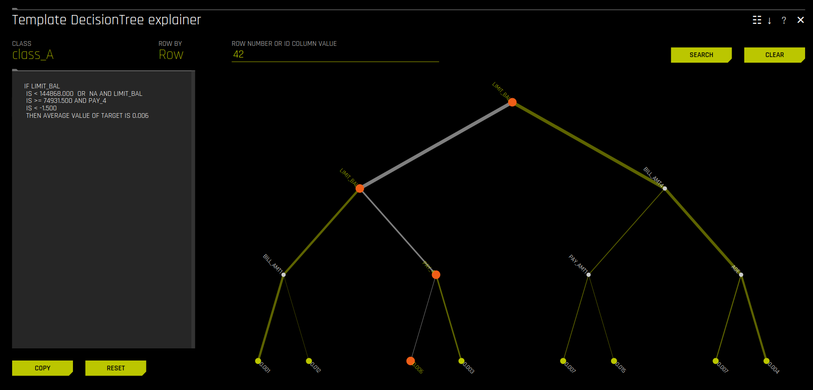

Custom explainers can use the following **options** to provide local explanations:

* **load cached explanation**
    * Explanations are pre-computed, normalized and persisted by [explain()](#explain) method. When a local explanation is requested by [Driverless AI RPC API](#python-client-api-reference), its runtime loads the explanation and returns it. Typically this is **the fastest** way how to provide local explanations.
* **on-demand explanation calculation** (async/sync)
    * If local explanations cannot be cached (for instance because the dataset is huge and local explanations computation would take too much time and/or would not fit to disk), then it must be computed **on-demand**. In this case Driverless AI explainer [runtime](#runtimes) instantiates the explainer, invokes [setup()](#setup) method and (a)synchronously invokes `explain_local()` method. The decision whether to invoke `explain_local()` method **synchronously** or **asynchronously** is up to the explainer - it **must** be stored as hint in normalized persisted local explanation descriptor.

In order to invoke `explain_local()` custom explainer method, [Python Client API](#python-client-api-reference) `get_explainer_local_result()` procedure is called. 

For **example** client can be invoked as follows to get ICE by **row number** for given **feature** 
and **class** (multinomial model explanation):

```python
        ice_by_row = h2o_client.get_explainer_local_result(
            mli_key=mli_key,
            explainer_job_key=explainer_partial_dependence_job_key,
            explanation_type=IndividualConditionalExplanation.explanation_type(),
            explanation_format=MimeType.MIME_JSON_DATATABLE,
            id_column_name=None,
            id_column_value="10",  # 0..10 ~ 11th row
            page_offset=0,
            page_size=1,
            result_format=MimeType.MIME_JSON,
            explanation_filter=[
                FilterEntry(IceJsonDatatableFormat.FILTER_FEATURE, local_feature),
                FilterEntry(IceJsonDatatableFormat.FILTER_CLASS, local_class),
            ],
        )
```

Both aforementioned local explanation creation options are described in subsequent sections.
#### Cached Local Explanation
**Cached** local explanations are dispatched by the representations themselfs - custom
explainer is neither instantiated nor its `explain_local()` method invoked.

The decision whether to dispatch local explanation request using **cached** 
representation's data or **on-demand** explainer invocation is made **automatically** 
by MLI BYORs runtime which calls representations's `is_on_demand()` method
as a part of `h2o_client.get_explainer_local_result()` dispatch:

* `False` return value means that representation is **able to return cached local explanations**
* `True` return value means that MLI BYOR runtime must use [On-demand Local Explanation](#on-demand-local-explanation) dispatch

**Example:** explainer declares that it provides local explanation as well as its type (`LocalFeatImpExplanation`):

```python
class TemplateFeatureImportanceExplainer(CustomExplainer):
    ...
    _local_explanation = True
    _explanation_types = [GlobalFeatImpExplanation, LocalFeatImpExplanation]

    ...
```

`explain()` method executed on interpretation [run](#run) creates local explanation
and also binds it to corresponding global explanation. Note that it uses
`LocalFeatImpDatatableFormat` representation:

```python
    ...

    def explain(self, X, y=None, explanations_types: list = None, **kwargs):

        local_explanation = LocalFeatImpExplanation(explainer=self)

        ...

        dt_format = LocalFeatImpDatatableFormat(
            explanation=local_explanation, frame=dt.Frame(data_dict)
        )
        local_explanation.add_format(dt_format)

        # associate local explanation with global explanation
        global_explanation.has_local = local_explanation.explanation_type()
        ...
```

... `LocalFeatImpDatatableFormat` representation class:

* `is_on_demand()` method returns `False` as `LocalFeatImpDatatableFormat` supports **cached** dispatch
* `get_local_explanation()` method, which can **load** cached local explanations, is implemented by `LocalFeatImpDatatableFormat`


Check `template_featimp_explainer.py` from [Explainer Templates](#explainer-templates) for
example of **cached local explanation** dispatch.


#### On-demand Local Explanation
There are **two types** of on-demand local explanation calculation:

* **synchronous**
   * `explain_local()` method is invoked on explainer instance created using **constructor** to get 
     the local explanation - can be used if load/transformation is fast and there
* **asynchronous**
   * `explain_local()` method is invoked on **fully checked and initialized** explainer - it's used
      when a calculation/scorer/transformation is needed

The decision whether to perform synchronous or asynchronous execution is made based on
**local explanation index file** flag which was created on explainer [run](#run) by
[explain()](#explain) method.

For example:

```python

# create local explanation
local_explanation = LocalDtExplanation(
    explainer=self,
    display_name="Local Explanation",
    display_category="Example",
)

# create index file
json_local_idx, _ = LocalDtJSonFormat.serialize_index_file(
    classes=["class_A", "class_B", "class_C"],
    doc=TemplateDecisionTreeExplainer._description,
)

# specify that local explanation is on-demand
json_local_idx[LocalDtJSonFormat.KEY_ON_DEMAND] = True

# specify that it will be dispatched SYNCHRONOUSLY
on_demand_params: dict = dict()
on_demand_params[LocalDtJSonFormat.KEY_SYNC_ON_DEMAND] = True
json_local_idx[
    LocalDtJSonFormat.KEY_ON_DEMAND_PARAMS
] = on_demand_params

# add local explanation to explanations returned by the explainer
# (it will be persisted by MLI BYORs runtime)
local_explanation.add_format(
    explanation_format=LocalDtJSonFormat(
        explanation=local_explanation,
        json_data=json.dumps(json_local_idx, indent=4),
    )
)
```

Example explanation's **index file** created by the code above looks like:

```
{
    "files": {
        "class_A": "dt_class_0.json",
        "class_B": "dt_class_1.json",
        "class_C": "dt_class_2.json"
    },
    "metrics": [],
    "documentation": "...",
    "on_demand": true,
    "on_demand_params": {
        "synchronous_on_demand_exec": true
    }
}
```

The **decision whether to invoke explainer in synchronous or asynchronous** mode
is done by MLI BYOR runtime **automatically** - it reads explanation index file
specified `h2o_client.get_explainer_local_result()` parameters (explanation type 
and MIME), and invokes explainer methods as described below.

**Synchronous** local explanation dispatch invokes explainer methods as follows:

* `__init__()` ([constructor](#constructor))
* [explain_local()](#explainlocal)

**Asynchronous** local explanation dispatch invokes explainer methods as follows:

MLI BYORs runtime invokes explainer **methods** to get **cached local explanation** on
`h2o_client.get_explainer_local_result()` procedure invocation as follows:

* `__init__()` ([constructor](#constructor))
* [check_compatibility()](#check-compatibility)
* [setup()](#setup)
* [explain_local()](#explainlocal)
* [destroy()](#destroy)

In both synchronous and asynchronous cases it is expected that local explanation will be
returned as string.

Check `template_dt_explainer.py` from [Explainer Templates](#explainer-templates) for
example of synchronous on-demand dispatch.
### explain_global()
Custom explainer **can** optionally implement `explain_global()` method to **(re)calculate** global explanation(s) **on-demand**. Such (re)calculation can be initiated using [Driverless AI RPC API](#python-client-api-reference).

<!--
`CustomExplainer` interface anticipates that instances of classes implementing this interface can run in different explainer runtimes/containers like Driverless AI or standalone (locally).

When implementing custom explainer for Driverless AI explainer runtime, this method doesn't have to be overridden as global explanations are typically computed, normalized and persisted. Driverless AI RPC API (which can be used using [Python Client API](#python-client-api-reference)) then looks up persisted global explanations automatically.

_...(see explain local)..._

_...(signature of explainer API)..._

_...(signature of Driverless AI RPC API)..._
-->

`explain_global()` method is **not supported** by Driverless AI `1.9.1` and older versions.
### destroy()
Custom explainer **can** optionally implement and override `destroy()` method to perform post explainer run **clean-up**.

As was already mentioned, `CustomExplainer` interface anticipates that instances of classes which implement it can run in different explainer [runtimes/containers](#Runtimes) like Driverless AI or standalone.

When implementing custom explainer for Driverless AI [runtime](#Runtimes), this method doesn't have to be overridden unless specific resources must be released or purged after explainer run.

`destroy()` method is **invoked** by MLI BYORs runtime on:

* [interpretation run](#Run)
* [on-demand local explanation run](#on-demand-local-explanation)

`destroy()` method:

* can be seen as `finally` section of `try`/`catch` in programming languages
* typically purges some content of explainer's working directory
* is **not** invoked on removal of the interpretation using [RPC API](#python-client-api-reference) (filesystem as well as internal data structures, like DB entities, are purged by MLI BYORs runtime automatically)


Please refer to [Explainer Python API](#explainer-python-api) for more details.
## Deploy
To deploy (upload from local machine or download from a URL) custom explainer recipe using **UI**, open MLI homepage by clicking `MLI` tab:

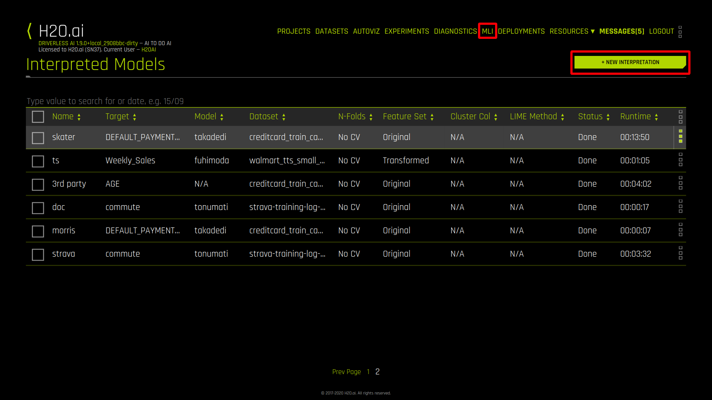

Click `NEW INTERPRETATION` button and choose `UPLOAD MLI RECIPE` to **upload** recipe from your computer:

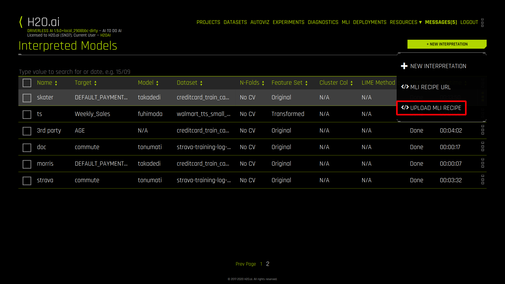

Custom recipe will be uploaded and it will be installed along with its dependencies.

Alternatively recipe can be **downloaded** from a URL specified using `MLI RECIPE URL` option.

---

Recipe can be also deployed using Driverless AI [Python Client API](#python-client-api-reference):

```python
recipe: CustomRecipe = h2oai_client.upload_custom_recipe_sync(recipe_file_path)
```
## List and Filter
[Python Client API](#python-client-api-reference) can be used to:

* list and filter **explainers** by:
    * **experiment type** (regression, binomial, multinomial)
    * **scope** (local, global)
    * **model** (DAI model)
    * **keywords** (any string)
    * **filter** (generic filter: IID/TS/image, requires model, etc.)
* list and filter **models** by:
    * applicable **explainer**
* list and filter **datasets** by:
    * explainable **explainer**

Filtering is also used when running explainers from Driverless AI MLI UI to offer compatible explainers only.

**Example**: list explainer **descriptors** with their name as well as properties and capabilities:

```python
explainers = [explainer.dump() for explainer in h2oai_client.list_explainers(
        experiment_types=None, 
        explanation_scopes=None,
        dai_model_key=None,
        keywords=None,
        explainer_filter=[]
)]

print(f"Found {len(explainers)} explainers")
for explainer in explainers:
    print(f"    {explainer['id']}")
    for key in explainer:
        print(f"        {key} {explainer[key]}")
```

Result contains explainer **details** which can be used to determine whether and how to run the explainer:

```
Found 12 explainers
    h2oaicore.mli.byor.recipes.sa_explainer.SaExplainer
        id h2oaicore.mli.byor.recipes.sa_explainer.SaExplainer
        name SA explainer
        model_types ['iid', 'time_series']
        can_explain ['regression', 'binomial']
        explanation_scopes ['global_scope']
        explanations [
            {'explanation_type': 'global-sensitivity-analysis', 
             'name': 'SaExplanation', 
             'category': None, 
             'scope': 'global', 
             'has_local': None, 
             'formats': []
            }
        ]
        parameters []
        keywords ['run-by-default']
    h2oaicore.mli.byor.recipes.dai_pd_ice_explainer.DaiPdIceExplainer
        id h2oaicore.mli.byor.recipes.dai_pd_ice_explainer.DaiPdIceExplainer
        name DAI PD/ICE explainer
        model_types ['iid', 'time_series']
        can_explain ['regression', 'binomial', 'multinomial']
        explanation_scopes ['global_scope', 'local_scope']
        explanations [
            {'explanation_type': 'global-partial-dependence', 
             'name': 'PartialDependenceExplanation', 
             'category': None, 
             'scope': 'global', 
             'has_local': None, 
             'formats': []
            }, {
             'explanation_type': 'local-individual-conditional-explanation', 
             'name': 'IndividualConditionalExplanation', 
             'category': None, 
             'scope': 'local', 
             'has_local': None, 'formats': []
            }
        ]
        parameters [
            {'name': 'features', 
             'description': 'List of features for which to compute PD/ICE.', 
             'comment': '', 
             'type': 'multilist', 
             'val': None, 
             'predefined': [], 
             'tags': ['SOURCE_DATASET_COLUMN_NAMES'], 
             'min_': 0.0, 
             'max_': 0.0, 
             'category': ''
            },
       ...
...
```

**Example:** custom explainers **filtering**:

```python
explainers = [explainer.dump() for explainer in h2oai_client.list_explainers(
        experiment_types=['multinomial'],
        explanation_scopes=["local_scope"],
        dai_model_key="4be68f15-5997-11eb-979d-e86a64888647",
        keywords=["run-by-default"],
        explainer_filter=[FilterEntry("iid", True)]
)]
```

Valid `FilterEntry` values can be determined from:

```
class ExplainerFilter:
    # explainers which support IID models
    IID: str = ModelTypeExplanation.IID
    # explainers which support TS models
    TIME_SERIES: str = ModelTypeExplanation.TIME_SERIES
    # explainers which support image
    IMAGE: str = ModelTypeExplanation.IMAGE
    # explainers which require predict method (model)
    REQUIRES_PREDICT: str = "requires_predict_method"
    # explainer ID to get particular explainer descriptor
    EXPLAINER_ID = "explainer_id"
```

Check [Python Client API Jupyter Notebook](https://github.com/h2oai/driverlessai-recipes/blob/master/explainers/notebooks/mli-byor.ipynb) for more examples.
## Run
To **run** custom explainer, click `NEW INTERPRETATION` button on MLI homepage: 

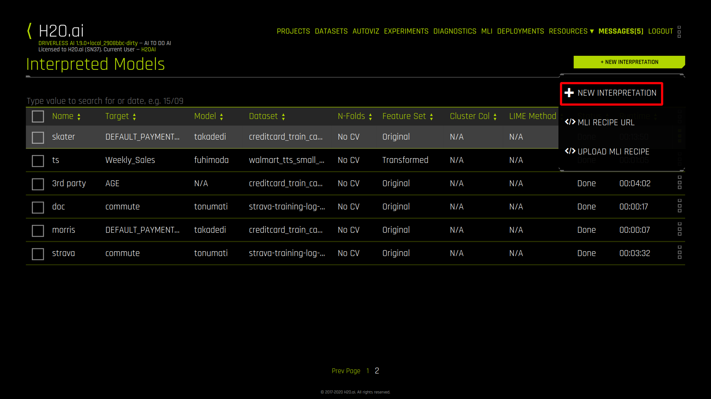

After new interpretation dialog opens, choose model, dataset and select explainer(s) you want to run:

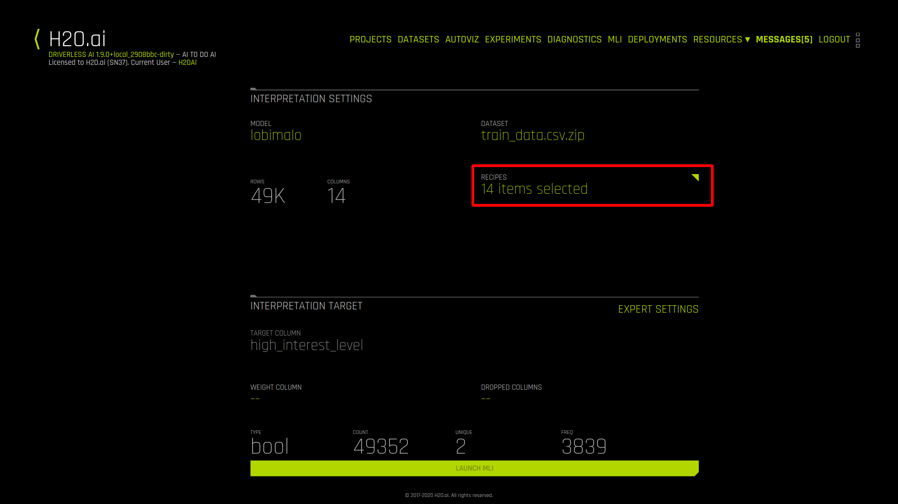

To run particular explainer only, uncheck all others, choose the explainer and click `DONE`:

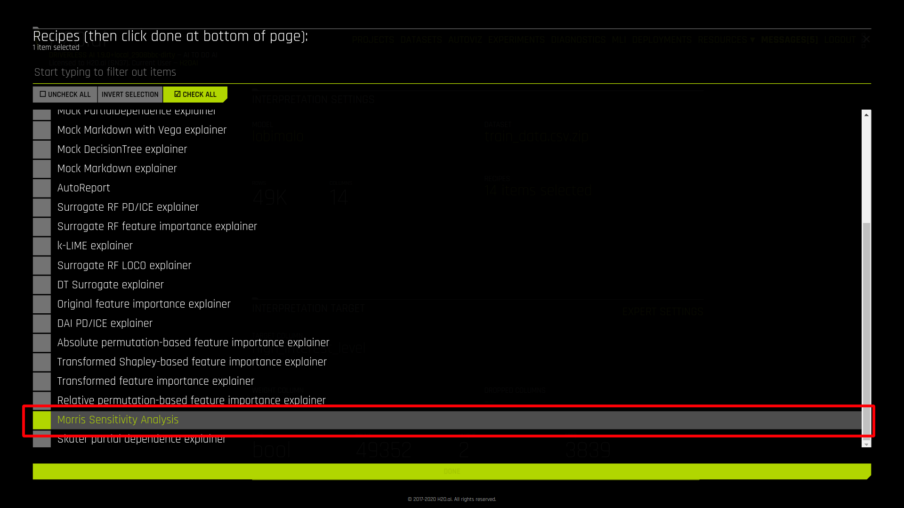

When ready, click `LAUNCH MLI` to run the interpretation:

---

MLI BYORs runtime invokes **explainer methods** on interpretation run as follows:

* **Preparation: explainers check and execution plan creation**:
   * `__init__()` ([constructor](#constructor))
   * [check_compatibility()](#check-compatibility)
* **Sequential explainers execution**:
   * `__init__()` ([constructor](#constructor))
   * [setup()](#setup)
   * [explain()](#explain)
   * [destroy()](#destroy)

---

Custom explainer recipe can be also run using Driverless AI [Python Client API](#python-client-api-reference):

```python
explainer_id="h2oaicore.mli.byor.recipes.sa_explainer.SaExplainer"

explainer_params={"rows_to_score": 3}

explainers_params: CommonDaiExplainerParameters = h2oai_client.build_common_dai_explainer_params(
    target_col="target_column",
    model_key="5be68f15-5997-11eb-979d-e86a64888647",
    dataset_key="6be68f15-5997-11eb-979d-e86a64888647",
)

job: ExplainersRunJob = h2oai_client.run_explainers(
    explainers=[
        Explainer(
            explainer_id=explainer_id,
            explainer_params=str(explainer_params),
        )
    ],
    params=explainers_params,
)
```

Hints:

* valid explainer IDs can be determined using [List and Filter](#list-and-filter) procedures
* `explainers` argument is list - **any number** of explainers (not just one ) can be run
* **per** explainer [parameters](#parameters) are passed using **string** 
  `explainer_params` argument which  does not have specified format
  (however, typically it's JSon or TOML) and it's up to custom recipe author 
  to define it's structure and content
* explainers parameters (like target column or columns to skip) - which are passed to/shared 
  by all explainers (and can be created using `build_common_dai_explainer_params()` which provides
  default values) - are defined as follows:

```
CommonExplainerParameters
  target_col str
  weight_col str
  prediction_col str # no model explanation
  drop_cols str[]
  sample_num_rows int # >0 to sample, -1 to skip sampling

CommonDaiExplainerParameters
  common_params CommonExplainerParameters
  model ModelReference
  dataset DatasetReference
  validset DatasetReference
  testset DatasetReference
  use_raw_features bool
  config_overrides str
  sequential_execution bool
  debug_model_errors bool
  debug_model_errors_class str
```

`ExplainersRunJob` contains explainer jobs keys as well as interpretation status:

```
ExplainersRunJob
  explainer_job_keys str[]
  mli_key str
  created float
  duration int
  status int
  progress float
```

In order to determine interpretation or explainer job status use:

* `get_explainer_job_status(mli_key: str, explainer_job_key: str) -> ExplainerJobStatus`
* `get_explainer_job_statuses(mli_key: str, explainer_job_keys: List[str]) -> List[ExplainerJobStatus]`

Check [Python Client API Jupyter Notebook](https://github.com/h2oai/driverlessai-recipes/blob/master/explainers/notebooks/mli-byor.ipynb) for more explaines and end to end explainer run scenario.
## Debug
Custom explainer Python API:

* Recipe author can use `self.logger` instance attribute to log debugging messages. This messages are stored to explainer's log.
* Explainer runtime logs explainer related **events/errors** using the same logger which ensures that log contains full explainer run trace.

To get explainer log - with your, explainer runtime and explainer log items - from UI, click task manager `RUNNING | FAILED | DONE` button in the upper right corner of running interpretation and hover over explainer's entry in the list of tasks:

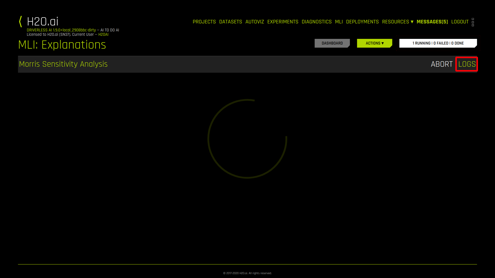

Buttons allowing to abort the explainer and get its logs will appear.

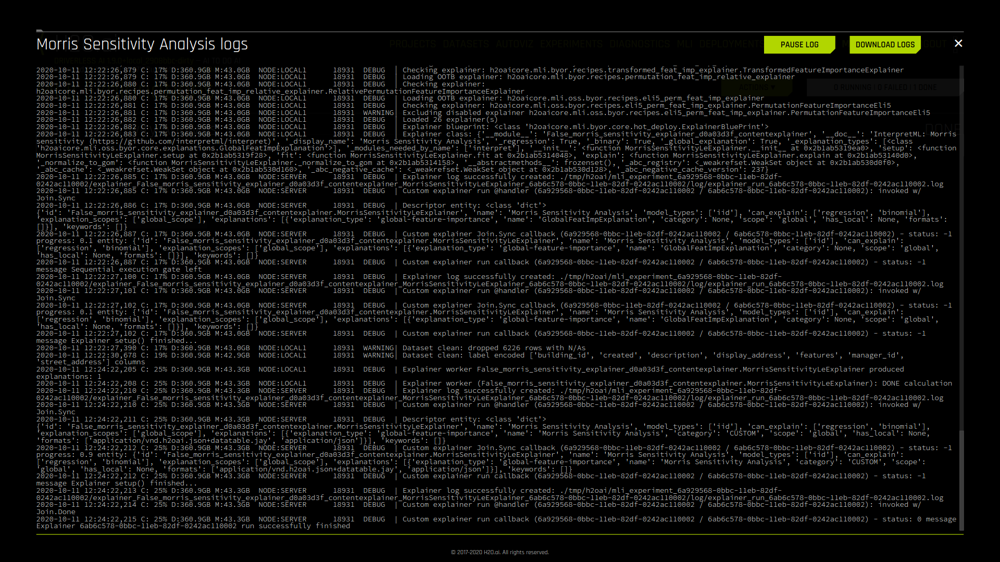

Use log to determine root cause of the failure, fix it and simply re-deploy the custom explainer in the same way as it was deployed.

---

[Python Client API](#python-client-api-reference):

Every explainer **run** has its own **log** which can be downloaded from the server in order to determine what failed/succeeded:

```python
url: str = h2oai_client.get_explainer_run_log(explainer_id)
...
h2oai_client.download(url, target_directory)
```
## Get
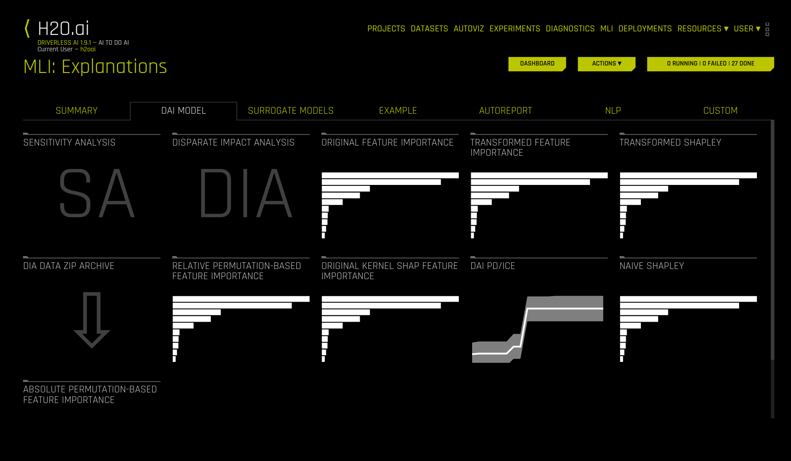

Explanations can be viewed in Driverless AI UI as interactive charts. Any custom explainer recipe which 
creates normalized ([Grammar of MLI](#grammar-of-mli) compatible) explanations, can show these
explanations in UI.

Explanations which are not normalized can be downloaded - either using [Snapshots](#snapshots)
or as [(working directory) archive](#CustomExplanationFormat) when such representation is created.

---

Custom explainer recipe can be also get using Driverless AI [Python Client API](#python-client-api-reference).
Following sections explain how to:

* perform [Explanations Introspection](#explanations-introspection) to find out which explanations and in which formats are available
* download [Explanations](#explanations) representations 
* download explainer [Snapshot](#snapshots) with all its working directory data, normalized explanations and logs

Check [Python Client API Jupyter Notebook](#python-client-api-jupyter-notebook) with examples of how to lookup and download explanations.
### Explanations Introspection
[Python Client API](#python-client-api-reference) can be used to perform 
explanations **introspection** to find out **which explanations** and in **which formats** 
are available.

In order to understand the API more easily check how are explanations stored on the server side:

```
mli_experiment_0b83998c-565d-11eb-b860-ac1f6b46eab4/
  explainer_h2oaicore_mli_byor_recipes_sa_explainer_SaExplainer_0b83998e-565d-11eb-b860-ac1f6b46eab4
  ...
  explainer_..._TemplatePartialDependenceExplainer_0e3fc89b-565d-11eb-b860-ac1f6b46eab4
    .
    ├── global_partial_dependence
    │   ├── application_json
    │   │   ├── explanation.json
    │   │   ├── pd_feature_0_class_0.json
    │   │   ├── pd_feature_0_class_1.json
    │   │   ├── pd_feature_0_class_2.json
    │   │   ├── pd_feature_1_class_0.json
    │   │   ├── pd_feature_1_class_1.json
    │   │   └── pd_feature_1_class_2.json
    │   └── application_json.meta
    ├── global_work_dir_archive
    │   ├── application_zip
    │   │   └── explanation.zip
    │   └── application_zip.meta
    ├── local_individual_conditional_explanation
    │   ├── application_vnd_h2oai_json_datatable_jay
    │   │   ├── explanation.json
    │   │   ├── ice_feature_0_class_0.jay
    │   │   ├── ice_feature_0_class_1.jay
    │   │   ├── ice_feature_0_class_2.jay
    │   │   ├── ice_feature_1_class_0.jay
    │   │   ├── ice_feature_1_class_1.jay
    │   │   ├── ice_feature_1_class_2.jay
    │   │   └── y_hat.jay
    │   └── application_vnd_h2oai_json_datatable_jay.meta
    ├── log
    │   ├── explainer_run_0e3fc89b-565d-11eb-b860-ac1f6b46eab4_anonymized.log
    │   ├── explainer_run_0e3fc89b-565d-11eb-b860-ac1f6b46eab4.log
    │   └── logger.lock
    ├── result_descriptor.json
    └── work
        ├── raw_data_frame.jay
        └── EXPLAINER_DONE
```

Directory listing above shows:

* interpretation directory `mli_experiment_<key>` which includes directory for every explainer 
  which was ran as a part of the interpretation
* per-explainer directory `explainer_<explainer id>_<key>` which contains:
   * explainer **working directory** `work`
   * explainer **logs directory** `log`
   * **per-explanation** directory (see below)
* per-explanation directory `global_<explanation type>` or `local_<explanation type>` which contains:
   * explanations are prefixed with **scope** followed by explanation **type** ([CustomExplanation](#customexplanation))
     like `global_partial_dependence`
   * per-explanation **representation** directory (see below)
* per-explanation **representation** directory is identified by (escaped) **MIME** type (format) like `application_json`
  which contains:
   * **index file** `explanation.<MIME extension>` whose name is always `extension.` and extension is driven by MIME type
   * optional **data file(s)** which contain (typically per-feature and/or per-class) explanation data,
     format is defined by [Grammar of MLI](#grammar-of-mli)

[Python Client API](#python-client-api-reference) can be used to determine (for particular interpretation):

* list of executed explainers
* list of explanations created by the explainer
* list of formats available for the explanation
* download URL for given representation

**Example:** getting representations of the interpretation shown in the directory listing above.

**List explainers** which were ran withing interpretation (`mli_key`) using `get_explainer_job_statuses()` procedure:

```python
explainer_job_statuses=h2oai.get_explainer_job_statuses(
    mli_key="0b83998c-565d-11eb-b860-ac1f6b46eab4",
    explainer_job_keys=None,  # get all keys
)

print(f"Explainers run in {mli_key} interpretation:")
for explainer_job_status in explainer_job_statuses:
    pprint.pprint(explainer_job_status.dump())
```

It returns explainer **result descriptors** listing **explanations** and **formats**. Entry for
the directory listing from above looks like:

```
Explainers run in 0b83998c-565d-11eb-b860-ac1f6b46eab4 interpretation:

...

{'explainer_job': {'child_explainers_job_keys': [],
                   'created': 1610624324.2524223,
                   'duration': 489.0938754081726,
                   'entity': {'can_explain': ['regression',
                                              'binomial',
                                              'multinomial'],
                              'explanation_scopes': ['global_scope',
                                                     'local_scope'],
                              'explanations': [{'category': 'EXAMPLE',
                                                'explanation_type': 'global-partial-dependence',
                                                'formats': ['application/json'],
                                                'has_local': 'local-individual-conditional-explanation',
                                                'name': 'Template PD/ICE',
                                                'scope': 'global'},
                                               {'category': 'EXAMPLE',
                                                'explanation_type': 'local-individual-conditional-explanation',
                                                'formats': ['application/vnd.h2oai.json+datatable.jay'],
                                                'has_local': None,
                                                'name': 'Template ICE',
                                                'scope': 'local'},
                                               {'category': 'EXAMPLE',
                                                'explanation_type': 'global-work-dir-archive',
                                                'formats': ['application/zip'],
                                                'has_local': None,
                                                'name': 'Template PD/ICE ZIP',
                                                'scope': 'global'}],
                              'id': 'False_template_pd_explainer_2dc07fea_contentexplainer.TemplatePartialDependenceExplainer',
                              'keywords': ['template'],
                              'model_types': ['iid'],
                              'name': 'Template PD/ICE explainer',
                              'parameters': []},
                   'error': '',
                   'message': 'Explainer 0e3fc89b-565d-11eb-b860-ac1f6b46eab4 '
                              'run successfully finished',
                   'progress': 1.0,
                   'status': 0},
 'explainer_job_key': '0e3fc89b-565d-11eb-b860-ac1f6b46eab4',
 'mli_key': '0b83998c-565d-11eb-b860-ac1f6b46eab4'}

...
```

**Descriptors** can be used to **filter** and/or **lookup** explanations user needs for example
just by iterating and testing types/scopes/MIMEs of created explanations. 

Descriptor for particular **explainer job** can be get as follows:

```
explainer_descriptor = h2oai.list_explainer_results(
    explainer_job_key="0e3fc89b-565d-11eb-b860-ac1f6b46eab4"
)
```

Response:

```
{
 'id': 'False_template_pd_explainer_2dc07fea_contentexplainer.TemplatePartialDependenceExplainer',
 'name': 'Template PD/ICE explainer',
 'model_types': ['iid'],
 'can_explain': ['regression', 'binomial', 'multinomial'],
 'explanation_scopes': ['global_scope', 'local_scope'],
 'explanations': [{'explanation_type': 'global-partial-dependence',
   'name': 'Template PD/ICE',
   'category': 'EXAMPLE',
   'scope': 'global',
   'has_local': 'local-individual-conditional-explanation',
   'formats': ['application/json']},
  {'explanation_type': 'local-individual-conditional-explanation',
   'name': 'Template ICE',
   'category': 'EXAMPLE',
   'scope': 'local',
   'has_local': None,
   'formats': ['application/vnd.h2oai.json+datatable.jay']},
  {'explanation_type': 'global-work-dir-archive',
   'name': 'Template PD/ICE ZIP',
   'category': 'EXAMPLE',
   'scope': 'global',
   'has_local': None,
   'formats': ['application/zip']}],
 'parameters': [],
 'keywords': ['template']
}
```
### Explanations
[Python Client API](#python-client-api-reference) `get_explainer_job_statuses()` and `list_explainer_results()` 
procedures described in [Explanations Introspection](#explanations-introspection) section can be used 
to get enough information to determine particular **explanation representation's URL** and **download it**:

```python
explanation_url=h2oai_client.get_explainer_result_url_path(
    mli_key=mli_key,
    explainer_job_key="0e3fc89b-565d-11eb-b860-ac1f6b46eab4",
    explanation_type="global-work-dir-archive",
    explanation_format="application/zip",
)

h2oai_client.download(explanation_url, "/home/user/Downloads")
```

To download **all** explanations of given explainer you can 
use [explanations descriptors introspection](#explanations-introspection) and 
simply iterate available explanations and formats:

```python
explainer_job_key="0e3fc89b-565d-11eb-b860-ac1f6b46eab4"

# get explainer result descriptor
explainer_descriptor = h2oai_client.list_explainer_results(
    explainer_job_key=explainer_job_key,
)

# download all explanations in all formats
for explanation in explainer_descriptor.explanations:
    for explanation_format in explanation.formats:
        explanation_url=h2oai_client.get_explainer_result_url_path(
            mli_key=mli_key,
            explainer_job_key=explainer_job_key,
            explanation_type=explanation.explanation_type,
            explanation_format=explanation_format,
        )
        print(
            f"\nDownloading {explanation.explanation_type} as {explanation_format} from:"
            f"\n  {explanation_url} ..."
        )
    h2oai_client.download(explanation_url, "/home/user/Downloads")
```

Result:

```
Downloading global-partial-dependence as application/json from:
  h2oai/mli_experiment_0b83998c-565d-11eb-b860-ac1f6b46eab4/explainer_False_template_pd_explainer_2dc07fea_contentexplainer_TemplatePartialDependenceExplainer_0e3fc89b-565d-11eb-b860-ac1f6b46eab4/global_partial_dependence/application_json/explanation.json ...

Downloading local-individual-conditional-explanation as application/vnd.h2oai.json+datatable.jay from:
  h2oai/mli_experiment_0b83998c-565d-11eb-b860-ac1f6b46eab4/explainer_False_template_pd_explainer_2dc07fea_contentexplainer_TemplatePartialDependenceExplainer_0e3fc89b-565d-11eb-b860-ac1f6b46eab4/local_individual_conditional_explanation/application_vnd_h2oai_json_datatable_jay/explanation.json ...

Downloading global-work-dir-archive as application/zip from:
  h2oai/mli_experiment_0b83998c-565d-11eb-b860-ac1f6b46eab4/explainer_False_template_pd_explainer_2dc07fea_contentexplainer_TemplatePartialDependenceExplainer_0e3fc89b-565d-11eb-b860-ac1f6b46eab4/global_work_dir_archive/application_zip/explanation.zip ...
```

Check [Python Client API Jupyter Notebook](https://github.com/h2oai/driverlessai-recipes/blob/master/explainers/notebooks/mli-byor.ipynb) for more examples.
### Snapshots
Explanations can be downloaded using Driverless AI UI as **snapshots**. Snapshot
is Zip archive of explainer directory as shown in [Explanations Introspection](#explanations-introspection)
directory listing.

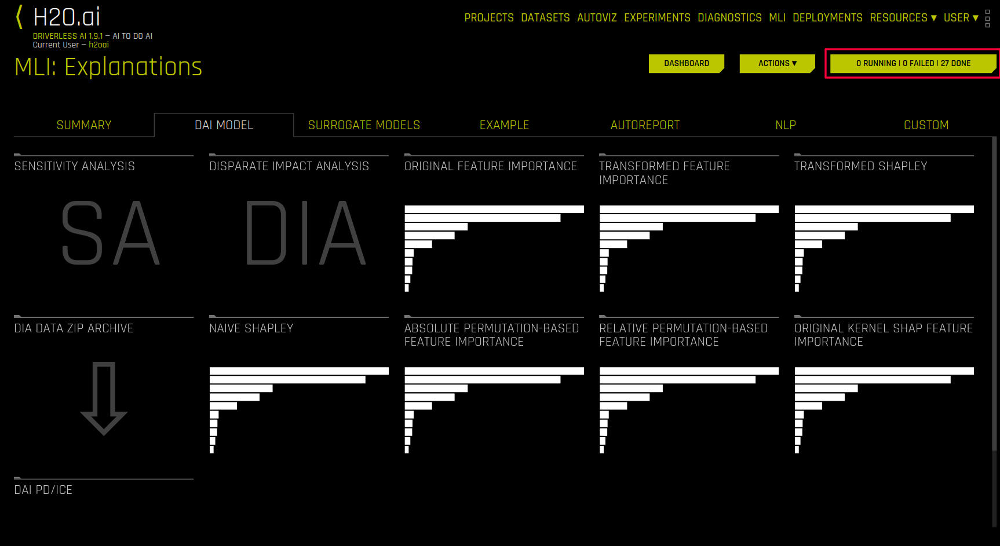

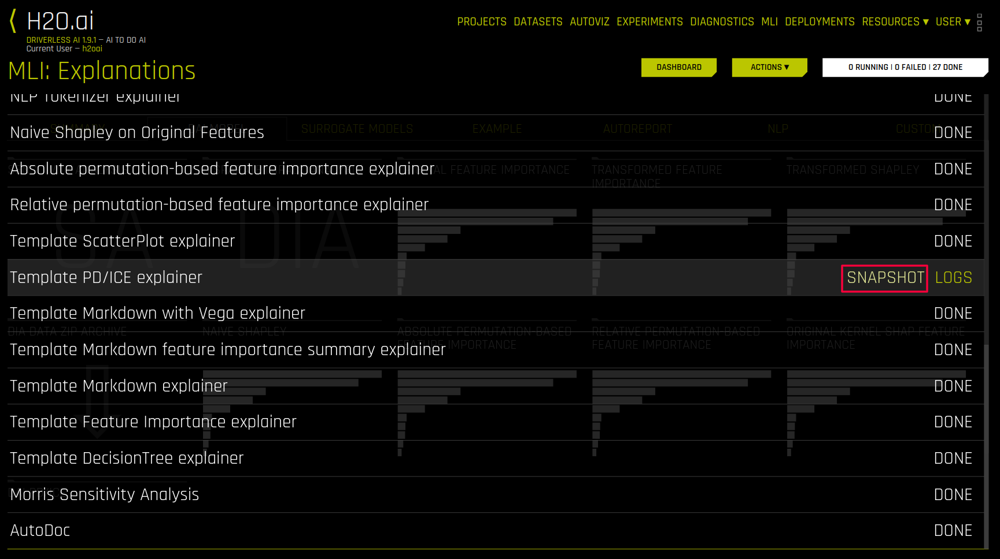

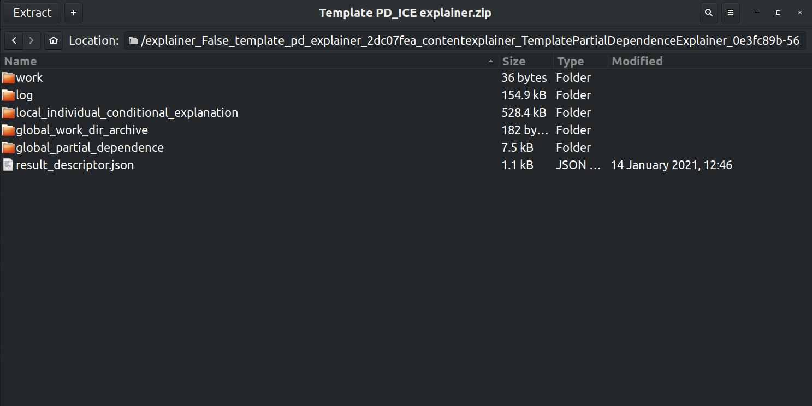

---

Custom explainer run snapshots can be downloaded also using [Python Client API](#python-client-api-reference):

```python
snapshot_url = h2oai_client.get_explainer_snapshot_url_path(
        mli_key=mli_key,
        explainer_job_key="0e3fc89b-565d-11eb-b860-ac1f6b46eab4",
)

h2oai_client.download(snapshot_url, "/home/user/Downloads")
```
## Visualize
Custom explainer results can be visualized using **Grammar of MLI** UI components in Driverless AI.
### Grammar of MLI
**Grammar of MLI** is a set of interactive charts which can render **normalized** results 
([explanations](#customexplanation) [representations](#customexplanationformat)) created by custom explainers. 
[Custom Explainer Python API](#explainer-python-api) provides helpers which aims to make 
explanations normalization easy.

Sub-sections of this chapter provide overview of available components and expected data format specification.

Please read [Explanations Introspection](#explanations-introspection) section and 
check **directory listing** there. Make sure that you understand the following concepts:

* index files
* data files
* explanation types
* explanation formats
#### Feature Importance
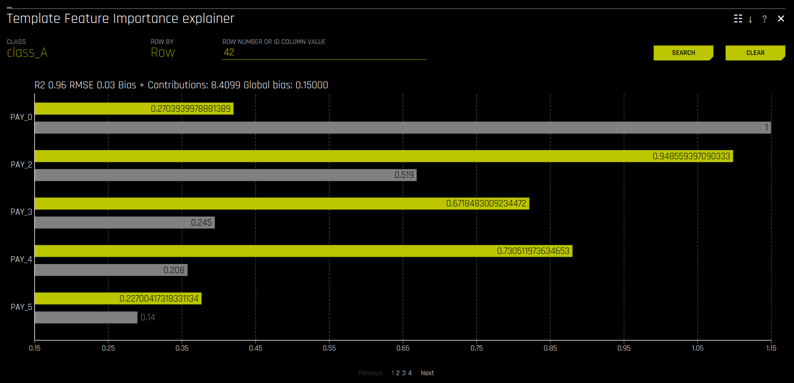

**Template** explainer:

* [template_featimp_explainer.py](https://github.com/h2oai/driverlessai-recipes/blob/master/explainers/explainers/templates/template_featimp_explainer.py)

**Custom Explainers API**

* explanations:
   * `GlobalFeatImpExplanation`
   * `LocalFeatImpExplanation`
* representations/formats:
   * `GlobalFeatImpJSonFormat`
   * `LocalFeatImpJSonFormat`

Example of the server-side **filesystem** directory structure:

```
.
├── global_feature_importance
│   ├── application_json
│   │   ├── explanation.json
│   │   ├── featimp_class_A.json
│   │   ├── featimp_class_B.json
│   │   └── featimp_class_C.json
│   └── ...
├── log
│   └── ...
└── work
    └── ...

```

**Index file** `explanation.json`:

```json
{
	"files": {
		"class_A": "featimp_class_A.json",
		"class_B": "featimp_class_B.json",
		"class_C": "featimp_class_C.json"
	},
	"total_rows": 20,
	"metrics": [{
		"R2": 0.96
	}, {
		"RMSE": 0.03
	}],
	"documentation": "Feature importance explainer..."
}
```

* `files` dictionary key is **class name**, value is **file name**
* `metrics` is dictionary of key/value pairs to be rendered atop chart
* `total_rows` is integer value used for paging
* `documentation` is shown on clicking `?` as help

**Data file(s)** per-class:

```
{
    bias?: num,
    data: [
        {
            label: str,
            value: num,
            scope: 'global' | 'local',
        }
    ]
}
```

- contains feature importances data for particular class
- `bias` - bias value (optional)
- `data` - feature importances (list)
    - `label` is name of feature
    - `value` is feature name
    - `scope` can be `global` for global or `local` for local explanations

For example:

```
{
	"bias": 0.15,
	"data": [{
		"label": "PAY_0",
		"value": 1.0,
		"scope": "global"
	}, {
		"label": "PAY_2",
		"value": 0.519,
		"scope": "global"
	}, {
    ...
```

[Open chart in Vega editor.](https://vega.github.io/editor/#/url/vega/N4IgJAzgxgFgpgWwIYgFwhgF0wBwqgegIDc4BzJAOjIEtMYBXAI0poHsDp5kTykSArJQBWENgDsQAGhBMkUANZkATmwbiAJmlkAbeQukACEAHcaG+mkMA2AAy2px+DTJYrA+45AakmFKgBtUHEkBDhtPyYdcJliJB0GOAg0IJA9JjgdbQAFAEEATQB9W2kQOITw9ABGSntSnDYIOnZJVFsAXylQdMycgsKAJlLyxO1bSgEqgE56xuaJNA6utKQMrPQ8ooBmYfjR9HGBgBYBWabMFsXO7tXejf6j3YqxygHbAA4z+dalm7W+oqnWJ7SogcZVI4lGQNc6XNrXFb-e5FaxPfZg2rWN5fC4LeHLHrrEAAGQAkgBZUkAFUKACFcsS0aDxrZIajoXNcT8EYSAYVcuSqVUmS9bFstsKObC8b9EXcQLTScTifzBZKyiDRVsPji4bLecjVVTHsDngdalUBkMpd8rgTbkTFcqjdaNWaMbYqlUdjauXa-vLNi6Reb7FMAOzqmG2-EBolBgVUoFu9Es2xTAY+kDRv2xuWOpUqxPJkbM2ofAbh3UynkO7ROouCk0psv2d51X162tIkAJwVZ0ui2zhybV7n2nsNo0DzWh2zWLbJnNdify3IAcQAoiGPfP02P-fm+Yn2S2hwJw59OzXVwXnSed2mtu9XcuawBddrvmQXTDRNCgJgcAAB6YNoABKAyoIY4xTNYhjgeSADKm7QSykLqnA4hQGwGiVKAWFAcoAEgAAZjQOjrKAg7oCYMB0OEnRkRIYGoNRs4gOBSDCBoMBIOINAgExpEsQA6nALhuGxZ7oOIbDKMgWTtMpMj8bA8naBAfjKGBMikcooSgioag4EJMhNGQIQ6MkgTfiA0DxEkKTBIZ2gAJ4Of+P5uTgoJyJopQaGwyA0K0oA+H4ESrF5ZE0JkWjoLyTEGeIZCgs4ri6dmSAaBooVkIsrwIiEYTaMBnkxCAmA+aCOihXASDETIQUhWF3i+P4VXRZV5Hxdog5MS1SCheSSDAWgVQyClaXaGYFgwKUqjqAlmDKIkMgAF5wKoaCretIACVAlR7XAxWuegOE6Bp3m+do8l5VZgXBcNbURZ1kQxb1OgJdmnKXMl-EzYEIAAMRMEwUB2MmIPtrDJSfnZY1OYEoDyXF4isWkcCkVlFXuXjP40IoSE0FtiwyIS2Q5Q9BWoEcm2hXh42oJN+Y2SdFMOgAwmwV3EbR9FAaUhIAGIsRB3G8fxNCOBA-EQAAtBA200KRwsOsSNAIHQE2eCAKjmGgpHxMrzXPaFPN87NguVUNoW7WtcAyFhOF4SRhI2aADA4BF+FVSBrGpEBWnaIzIFsKRAAUEUMAglClo4AA6IAAAJpyDGcK8nACUhgAIQALwF4YCvqjRIBmaAFmPegMdxwNn7KQiaOEdoTBsNgwWlHj6DlVAjnq2s7OO5zayWxpAsMYPmRixjEs8XxAmy-LSsq2rMgGytI-68o5jj-zoNw+2pSbwAIkgEALYE9MDHZm8API4PIdBuYVAhm61+-W1PH8vQ7+0XEUMPRIX4ZDIGUAoGyQcaraGMt7Uo+ku7SWNkdVi4UOpRSiJVEqoIUFwCynAnATBX6JTrCpEALtcJ+29r7EiJCq793-OgDyjCepxW+toJK5Dq4m2cgdc6GAJKZVKDQ3wfl+IaDmvQSOAByFhjkZHZyEnZCqUCXKlXQDCUo1VbroH8loKagN0pCLcL-e20k3raDwVlL6P03ySGUnZcBkC+E4Lbo1ZIelVAIBIpY9A1izJVRgegZQcAoBZUoW7aSoihbSXofZVh2gtF6XYXYv6CwmIZSkuxM0VQlggGZgwgevcCaxT6ugAaMhgJDGkj3AppSaL5PIpREidTLrXTKRwzR6SHFN2WDo0EQFQIIO8b4jBeiPGBMidQn2YiSKFM6T9apgSNDMyDkkTG0dfCx0oNUkuhg667NzgAHhsFCGSAgEQ0QVpcuy8TbHuVKBHUiys0GLO0FkrKCAGA6FYuMS5wkKLrHWSHdAWzMA7L2QrA52y47AROWcncMMPgosrjJXQ+hlGqTqpZPhwdNmHKhTCiFcKEV2B3NEHGaLy672EaA2QF9Mj1RIuXbWuV-xMSGW8h5tdYXx01MJcW0ly5cQXtLZe4hFbK13mrJuX55VAA)

---

**Local explanation:**

* [explain_local()](#explain-local)

```json
{
    "files": {},
    "metrics": [],
    "documentation": "Shapley explanations are ...",
    "on_demand": true,
    "on_demand_params": {
        "synchronous_on_demand_exec": true,
        "is_multinomial": false,
        "raw_features": true
    }
}
```

* `files` - same as global explanation
* `metrics` - same as global explanation
* `documentation` - same as global explanation
* `on_demand` - indicate whether local explanation should be dispatched [On-demand Local Explanation](#on-demand-local-explanation) 
  (`true`) or as [Cached Local Explanation](#cached-local-explanation) (`false`)
   * in case of on-demand dispatch, `files` and `metrics` don't have to be set
* `on_demand_params` - can contain **any** values which are needed in case of on-demand dispatch
   * `synchronous_on_demand_exec` - `true` in case of **synchronous** [On-demand Local Explanation](#on-demand-local-explanation),
     `false` in case of **asynchronous** [On-demand Local Explanation](#on-demand-local-explanation) 
   * ... any additional parameters
#### PD/ICE
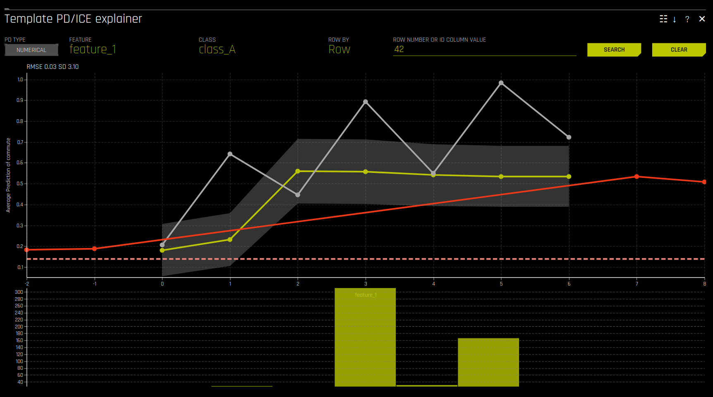

**Template** explainer:

* [template_pd_explainer.py](https://github.com/h2oai/driverlessai-recipes/blob/master/explainers/explainers/templates/template_pd_explainer.py)

**Custom Explainers API**

* explanations:
   * `PartialDependenceExplanation`
   * `IndividualConditionalExplanation`
* representations/formats:
   * `PartialDependenceJSonFormat`
   * `IceJsonDatatableFormat`

Example of the server-side **filesystem** directory structure:

```
.
├── global_partial_dependence
│   ├── application_json
│   │   ├── explanation.json
│   │   ├── pd_feature_0_class_0.json
│   │   ├── pd_feature_0_class_1.json
│   │   ├── pd_feature_0_class_2.json
│   │   ├── pd_feature_1_class_0.json
│   │   ├── pd_feature_1_class_1.json
│   │   └── pd_feature_1_class_2.json
│   └── ...
├── log
│   └── ...
└── work
    └── ...

```

**Index file** `explanation.json`:

```json
{
	"features": {
		"feature_1": {
			"order": 0,
			"feature_type": [
				"categorical"
			],
			"files": {
				"class_A": "pd_feature_0_class_0.json",
				"class_B": "pd_feature_0_class_1.json",
				"class_C": "pd_feature_0_class_2.json"
			}
		},
		"feature_2": {
			"order": 1,
			"feature_type": [
				"numeric"
			],
			"files": {
				"class_A": "pd_feature_1_class_0.json",
				"class_B": "pd_feature_1_class_1.json",
				"class_C": "pd_feature_1_class_2.json"
			}
		}
	},
	"metrics": [{
			"RMSE": 0.029
		},
		{
			"SD": 3.1
		}
	],
	"documentation": "PD and ICE explainer ..."
}
```

* `features` dictionary is **feature name**
* `feature_type` controls whether PD should be rendered as `categorical` or `numerical`
* `files` dictionary key is **class name**, value is **file name**
* `metrics` is dictionary of key/value pairs to be rendered atop chart
* `total_rows` is integer value used for paging
* `documentation` is shown on clicking `?` as help

**Data file(s)** per feature and per-class:

```
{
    prediction?: num,
    data: [
        {
            bin: num,
            pd: num,
            sd: num,
	        residual-pd?: num,
	        residual-sd?: num,
            ice?: num,
            histogram?: num,
            oor?: bool
        }
    ]
}
```

- contains PD for particular feature and class
    - `prediction` - original DAI model prediction (optional)
    - `data` - per-bin value (list):
      - `bin` - bin value
      - `pd` - partial dependence value
      - `residual-pd` - residual partial dependence value (optional)
      - `ice` - local explanation ~ ICE value (optional)
      - `sd` - standard deviation
      - `residual-sd` - residual standard deviation value (optional)
      - `histogram` - histogram value for given bin (optional)
      - `oor` - out of range indicator (bool)

For example:

```
{
	"data": [{
			"bin": -2,
			"pd": 0.18315742909908295,
			"sd": 0.1297120749950409,
			"histogram": 5,
			"oor": true
		}, {
			"bin": -1,
			"pd": 0.18658745288848877,
			"sd": 0.13090574741363525,
			"histogram": 27,
			"oor": false
		}, {
    ...
```

[Open in Vega editor.](https://vega.github.io/editor/#/url/vega/N4KABGBEAkDODGALApgWwIaQFxUQFzwAdYsB6UgN2QHN0A6agSz0QFcAjOxge1IRQyUa6SgFY6AK1jcAdpAA04KAHdGAExbYwANgAMuxREgpG1fFoBM+w1ELo1axjOpbRipZDXo8mHAG0lCFAIEKgZdFRkLUgfdgAbKJtQyAp0ONZkWC0A0Eh2Jy0ARkVIQjVCLW1CugBOABY6txBIblY8AHkAMwAldGconDwAJwyQAF9FXPy5HAsSsoqcbW06OoAOAHY1ktaOnr7qAbBh0YmQKYKcJtLyooBmOm07wu0Sxngjuos6UTWLOeaiEYsDw3GoQwiWjWdEKdwsdRKamQFEY3h4MzAhV040mzWmlXmt1mtRe22a7yOhWqNT01yBILBENQWjudToa1JiORqLw6KK2LOFwxG0JizA0JqFjuZMgFK0dWqokKdRqJXpoPBkJwX0eugs1yRKLRsksAtxeUu4tF8uqG0KdreHyKKzudxqdOBGqZrm+Gw2olezUNPL5OEKohx5zxltVzQWlged1EumuctmujoukKFhFgM9jK1YBzP3duc83ONGMKkaF-OtOFZ7N0fsdlJqqwsHLV+c1zIb4mWsfLRt5JrDZqjFqrxTjRLACszekDsqdDfb8NZ3YZvcq4g2zyHwcr-Jr0arAJuYqxMIaF7TYHEWMKQ-VBb7YA2MO0jS5I9DRYnWswzuet5w7fVWy0DMGmlLcvULdsqjWBEgwrUcqwjQUzyKFDL2dVYvmXe8rEefUQLzbdvSuCU-WXI90JPLCpyKa54xwT9dElO9V0xRM3QvV8dzDaonn+X8QzHTFAOwsNlzYotvgsZUZxXT42WfF8eyoh9FJqP5xOPK5T2YsMy3kuFHmfFT72VdkNnqOC30qT9lk3VC-0k8NjPxMMZXkzs6A2L5IO1aE7T1RyhJ0aFlXWAyGPHbzLWfUCVUzd1uKOZ5AruDZl0E7SA0eDYIvciSMSsJKKoMWcrwzbQlVTHjn0Cmpm0i7S7hWOo7TotD-0w80fKLFT5KK0RRHhHY2i6Xp+i0E5kCqywLzG9sXn9aa9jmw4FpGJaxhAABdJIQhiCEZFgTpuCGd8AlCUJgge5I8AAT0II5IGu27WDiTBTueyBkAAD0IIZoi8PBWFQOgFjAABqMBIehuh6L5AGHsgdAshwIxWAAEWRSBAges5nvJkInopmJ3s+77UF+-6ScBkGwYh7wUbhgBaJGOZhtGTQx5Jsa0Iw4kJihiYpw7nqOkmyYpynmbCCJPopLnOkYOI8GQIZkDUBRlcgaRWCGHiYnQeJEiN4Y+ium67uVoIoDej7ok17XdYUKBWfBnBIAAQgD5GYYpMAADJw7AYO+boXZZoOKIwBlh65dCBWgiN8JImiBYNa1nW9YNjHjdaM3PtiBJDcB23Lvp7InbAYAXdp92C69+QfdBv2oCDkPYfKCOo5jqGYfj-Z5uT5W05CDOm6z1Xol2fPPaL6vMZN8vokr62a4u+3bobinm5pt3-Y9wvvaB7voj72Px525Ah+jkfOduKfZfl06qbO7PPtfFehd9br2SJvc2O8QFnVrgfR2x8W5nygBfDuXc2b+zvqPOgBVIQf1TvLJQJ0QAeFgKYcIcQcZgHukrQGf8Ib9UFkbVI6RKTYnTkLee1DF7+xGFXEujCMgsS-o3H+RgaH+yRD4LW+NuAYAKHgiABCPAYCGAAa3IZQzONdW7+3BK0CoJdRG4C0pCEuyAZDwG4EiLQwizqmMvjgaxyRXpWJSGkfh2p9Bz0BiYMweBnF8KOFYXQnjMaqA0IgPxrijh6CCY3FOrDG6AwQGkTIR8qGYwMZAYGAAJfMkCjCu0+uwPoxcjYXV2v7UJmgS5qGkegS0wBPDeF8C7S2PDEGMGQHEA2-t8RxOTt-BeOd-avRyQyPJ8DPpxCcMgdA4MS5lKOH4QJnddAEMBgAL11twPaGRqm1PqY0nw0QAFILXp3L6HSunHKMcyPpKc1mKyxsDFJ-gSbWJaEMDpMhfE9O4AQaR4zjbwGSdEbJuSS7rKcEiYGRRBGPSNjdL5PyoAJE6L4kuSSq7DNGaCQF4J1A7KWunfB5ylGqNSc9d5BToh63gOio2nQhgAvsYc5pxh8yAN1sA4JQMzEWKOA4n23yvb2ISVAJwhdCDcD+jrCJTDohTJkDM8GwTkgwpZZiz6YKxnnM1p07pUBelsKME4jVwKsVQBGeC9p+rrmUUhKqs6r0LDOM1dEK1OqoD+Kgo6owlTwlmpBf7bVuLzlFJkAa4oUBuCdE6LAZAyKuaFF9e0uIcQ5VuMNfKlNFy03tDsPAZgpqm4uPlTgDMaw+nEuencmeEA55Uq0VAHRrA9GDM+jIuQJi+WWNFdTWxIr2GPO8eYFl3qGxrCCcalQ6hNBjsiZUDx07IDFoaeOsAMTpbK0dUC5Jai3nttBYC6lPTimAoWdEf1gKamducZDNlEDdWXINcxHNN66kyF6MoV1JC0i0IkeLfZcg7kDI4UMy1x6m2QEVcq89idsjSgMBuh5yRNlMsJXs29LL73b1aYkG1XS1F4XOXKc5D94PnPFkTc5BMiZHTfUBr9P7qCkP-XUwDt67kksbk8l5FCD2A0RbYhVyA0WArdcMvFnyDWLTkWAFDZ0yX7uPjbKDtL6WA0ZcyktOH-Z51Ody7t5je1DpZsKnugqjASt1lKmVArS2Zug9M2ZkAc3qpLRJqAMKn22p6QUHNq7d0WpXVfPVVz-ZUclgFl1gbgtOJ8+FqAtGovLqvbFrVV9w2RrI7G+Nibk3Lo9um+dZaoAAGIABCdx8Y1AAKLaFc4VrWcR83oELW9DNRwK1VtntuuFaSXpQdgK9VA7BpWAq0++BpunbDlE5WvHlpjjMCp4wOizYrZTmds94ez66nNKpc25115qMsJZffiHLcaE3HaDV5zLZ7y0-DGAFm7cXQvPtzrcHNIImXKN2wu7RetTGNY2z97gf2ADqs6A0lvXXcHr9a+vxPhZohBxsRtjfTSXSbd6mnRHVgZg2i2e0rf7eZqxG3rNDG27KkrjmYOHeXe5hpnnMnvd84agol28uvdO4ah7G6nsvfS+69niXVIg8VlAMHf3OvRDK-oXQkvHky+QFDsJcuwwI5wdW2eoHMYnulxj8b2OmVTdZUvNo83DNGyW-yinZO7GmfJptyV0qdua5Rc5lVTPedHrO9EC70bcvXZF8G+7EaoJC+XYF1n8WCMvvjN94Y4P-ulZXZ0uI3Bv3J9+2r6Hnv4exKR3roRqm0cwYm2b3HRz-YQOJ8th3Lu1tN+plTmnaf6fe+V9TZnQW+cXI56+mPfvJPnOISxv9XDfpRFz6nz3kAyuxo2MgeyPeXeq-V3O2HAPMRz7+-jbGAa12778NsOo9Hi81rk6EOtOuwD4PGCAIAA/view)

---

**Local explanation:**

* [explain_local()](#explain-local)

```json
{
    "features": {
        "feature_1": {
            "order": 0,
            "feature_type": [
                "numeric"
            ],
            "files": {
                "class_A": "ice_feature_0_class_0.jay",
                "class_B": "ice_feature_0_class_1.jay",
                "class_C": "ice_feature_0_class_2.jay"
            }
        },
        "feature_2": {
            "order": 1,
            "feature_type": [
                "numeric"
            ],
            "files": {
                "class_A": "ice_feature_1_class_0.jay",
                "class_B": "ice_feature_1_class_1.jay",
                "class_C": "ice_feature_1_class_2.jay"
            }
        }
    },
    "metrics": [],
    "y_file": "y_hat.jay"
}
```

The same structure as in case of global explanation, except optional fields:

* `on_demand` - indicate whether local explanation should be dispatched [On-demand Local Explanation](#on-demand-local-explanation) 
  (`true`) or as [Cached Local Explanation](#cached-local-explanation) (`false`)
   * in case of on-demand dispatch, `files` and `metrics` don't have to be set
* `on_demand_params` - can contain **any** values which are needed in case of on-demand dispatch
   * `synchronous_on_demand_exec` - `true` in case of **synchronous** [On-demand Local Explanation](#on-demand-local-explanation),
     `false` in case of **asynchronous** [On-demand Local Explanation](#on-demand-local-explanation) 
   * ... any additional parameters
#### Markdown
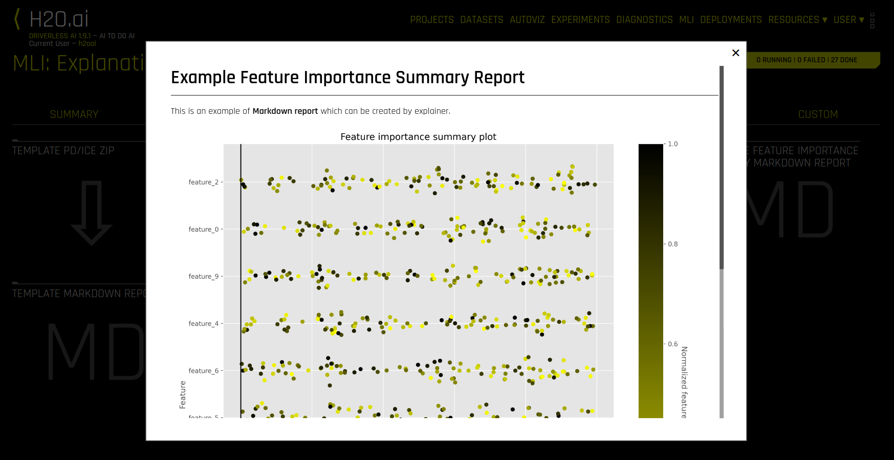

**Template** explainers:

* [Markdown with Pandas images](https://github.com/h2oai/driverlessai-recipes/blob/master/explainers/explainers/templates/template_md_explainer.py)
* [Markdown with Vega diagrams](https://github.com/h2oai/driverlessai-recipes/blob/master/explainers/explainers/templates/template_md_vega_explainer.py)
* [Markdown with feature importance summary chart](https://github.com/h2oai/driverlessai-recipes/blob/master/explainers/explainers/templates/template_md_featimp_summary_explainer.py)

Example of the server-side **filesystem** directory structure:

```
.
├── global_report
│   ├── text_markdown
│   │   ├── explanation.md
│   │   └── image.png
│   └── ...
├── log
│   └── ...
└── work
    └── ...
```

**Index file** - Markdown report itself - `explanation.md`:

```
# Example Report
This is an example of **Markdown report** which can be created by explainer.


```

**Data file(s)**:

* directory may contain also **images** (like `image.png`) or any other artifacts references from the report

---

**Local explanation** is not supported.
#### Decision Tree


**Template** explainer:

* [template_dt_explainer.py](https://github.com/h2oai/driverlessai-recipes/blob/master/explainers/explainers/templates/template_dt_explainer.py)

**Custom Explainers API**

* explanations:
   * `GlobalDtExplanation`
   * `LocalDtExplanation`
* representations/formats:
   * `GlobalDtJSonFormat`
   * `LocalDtJSonFormat`

Example of the server-side **filesystem** directory structure:

```
.
├── global_decision_tree
│   ├── application_json
│   │   ├── dt_class_A.json
│   │   ├── dt_class_B.json
│   │   ├── dt_class_C.json
│   │   └── explanation.json
│   └── ...
├── log
│   ├── explainer_run_0f22e430-565d-11eb-b860-ac1f6b46eab4_anonymized.log
│   ├── explainer_run_0f22e430-565d-11eb-b860-ac1f6b46eab4.log
│   └── ...
├── log
│   └── ...
└── work
    └── ...
```

**Index file** `explanation.json`:

```json
{
	"files": {
		"class_A": "dt_class_A.json",
		"class_B": "dt_class_B.json",
		"class_C": "dt_class_C.json"
	},
}
```

* `files` dictionary key is **class name**, value is **file name**

**Data file(s)** per per-class:

```
{
    data: [
        {
          key: str,
          name: str,
          parent: str,
          edge_in: str,
          edge_weight: num,
          leaf_path: bool,
        }
    ],
    trainRmse?: str,
    cvRmse?: str,
    r2?: str,
    klimeNfolds?: str
}
```

- contains tree data for particular feature:
    - `data` - tree node value (list)
      - `key` - unique node ID
      - `name` - human readable node name
      - `parent` - unique parent node ID
      - `edge_in` - human readable edge name bettwen node and parent node
      - `edge_weight` - edge weight value
      - `leaf_path` - flag for selected row path
    - `trainRmse` - RMSE value (optional)
    - `cvRmse` - CV RMSE value (optional)
    - `r2` - R2 value (optional)
    - `klimeNfolds` - number of folds value (optional)

For example:

```
{
	"data": [{
		"key": "0",
		"name": "LIMIT_BAL",
		"parent": null,
		"edge_in": null,
		"edge_weight": null,
		"leaf_path": false
	}, {
		"key": "0.0",
		"name": "LIMIT_BAL",
		"parent": "0",
		"edge_in": "< 144868.000 , NA",
		"edge_weight": 0.517,
		"leaf_path": false
	}, {
    ...
```

[Open in Vega editor.](https://vega.github.io/editor/#/url/vega/N4IgJAzgxgFgpgWwIYgFwhgF0wBwqgegIDc4BzJAOjIEtMYBXAI0poHsDp5kTykSArJQBWENgDsQAGhAB3GgBN6aABwAGNTPg0yWNAI0ykDTGwg0AXnDQgAZnWkgmSKAGsyAJzYNxCm0wAbF1dHHCQFBRpxMjQAbU0AFkTkgF0ZczJxJACIONAshGt0OkQAYTYAtg9HYmyGIpAAYiYmKAA2NQEQAF80kAUkTBRUWPykQptMDzhrGVqA+tyR0Fc4AE8bHGnIqEx2cQg1SiSATgBmAHYEk4BGM4THAoatuB29iVyZMOnxTBtHV5kOBRf4yQFwWTA3R-VCaEABOBIWwAfTCylQtmyEDgMgAHmhxAwAgEZBtYTIFHAcOi4bAaAEFD80AAmbpSFbrTbbGi7faHY5qc5XW73AC0LzefKONxUZxUCRUzJO6ke42e3N5H1CSB+MJAEp57wOR1Ol2udweYIUQJB6AAPAACE2Ch1SB0AOQAggDrRCoXp0EcVAIbo4EUjUYMYGhMTkcSB8ahCcTSWgbgqKVT0TcZHSGUzUKz2SBVmT9RqjfzTcKLeKK1LKDK5Qqleo669DQ2bjdOmoFUlQzInlyO5qDtrdSPJR9nULzWKDWP+U35YrlWofTbJPanY3Za6Pd6rUDIToAyAjm1mW0w4iUWjoxisfHE8mSSAyUq2pnqY-mbmYHpRk4G3IsOTLRdK1nM0RQSdtp2NPdmzXNtIK7HsDH7NQblFI41HlPD5SSENmQVVUJkDSh8MtfUdRAvU0JnAU51g+DOyYlcW3XNil2lDC+wIwcQHBW0QEdPi1APL1Nz9M89SOM4zg3GRw3vKMY2fPECSJd8yQSfSf3RM4AKAgs1DZcCp3YxDq3nODGMQziULUHioMbfisJw6UEgubyLmZe59LOG8hzVGw-IneirN45iYNrBzl1lVdWxchKJMwwSZNEgA+ABeXdu2U4TfVPaFwsoJUuhUu9I3RWNsS0pMdNTVB9ISQzH2MkA82A7dzOLUtorc2zWLSpDku4sbmWDRS2hOC4LnI9VR0rSLfiGhsRvi+sOKSriVWPYFtxAPKCtlGTSvPI5mWvW8IwfDS40at8Wq-DqWRM-MQJZCyS05dAxq2hcdscvbnNchtpoEWb5ouXCKuZXyEYuM5zgENGlvKm7Fq+Oj1oBkGq0FOLgZWrswZSiGmKhmGFqy47xIq4MLv9eTGwSEL4Rqh6nyehNtJTD80Da97UC6nqzN+waCbJpigfswnpQpybFaZ6Hgth+HFKSShtYuAQ2juA3Mco7W1oY1X5ap0HkMpqaZo1unDpy-LruZw7LrZ-CitU2rH3ql8Bd04WDP6LNOs+3q0H6yyZYQomWO22XEKvA2BCuEMzhN8tk8+WjJzj6yE5JmiROO07ZxZuTyvTE47rUurNP5prBbJdMVFFnNusAr7QKl-6c-j6Ca1JofKFTtp04STPrf5TOTgEaHF854dC6Xc2Nrl4mR4V3PL2ZNOM7uembEZ1Oq7Kyi1EN+u-cehrm5eoXCxOb8w9-D7u9M77C37iDLe3nZWe+9D7TzuMAyg89F5nGXvDNqJp9LMg0FcGB2cEE0W+FFNew1AGjVVhPKeM8xpQKXsbZ2DNdyZwvldKiSlb48wDs9Zqz8RbvyMpHSWA0B6A1wUnMeBCj5nAgSQmBBt4aL3UJAgQKgFoCBusfUKFELxSJUBvbBm1eGjyLiAyegjhF3AXqQzmZcbAV0gQo4qJ5WblTUGcISvsGFN1fMwvSodKQfzFhwn+Mc-r-z3rFHeECBFgKEWNC4dx-KIwwtnBKajB7aICUAsawSqHkNMa7ceB9qFexUKo6q911K8wfs41uLJX6i3-F-XuP0uF+LHlbZJB9dEhIgeEy42MMLwzaB0S8HQTgnDat2NB48OhxJ4YnLRMUUngLCREjpnQT47iOG07JNiEj2O5oUxhj8XEh3amwiOVSo6wj-pvGymjd78KaYQmZqs2mRPCZ0eG+slKUBeT5G4C1lTDJeWMgBEzLkJOmaEu5cyokLLSegMxKyPbWKvj5ehWynFBxaqw9x7CjmSz6FMJABxbBVAQHkEAmA1g4AaBAHFexbAbBkNLXx5sADS3C8Z-F+iSslkxpizBAIUegbA-DoD2AoGlIBzBWCJRkLIAQbDyCUNGX6krsg2G0GVXo6QqQ6kGPsNAUx6hGCWLEfmqZ3peMkCkXov1V7wiiK4POYgGAeCgA0KYMxHA4rxQSol7LnVcoCDa3IbLSUND9eIVwD0LV9GQB4W1Xqg2bHUjIWwXhCWoFAAMIYNgQ0xrZMJcQUB+VFFAAwHA6bC20XRKAewcAGTxuUDmilXhVhoFAIq6V6B00MAQJQIYHggSYEoA4qMAB+B0AByWQgFMBwFHQ6VADoSgIHKJUao9aphsFWAAdUUBW0VOgpU2GZA6AA1A6Q9AAqB0AAKDtXae19soOCT2DoCC7gPgASh6DINgYQoB0DJKAeY9Ro6QO6KBwNHL0AQDWAgJgFRHBJrYCmtNgxhjEq5Z+3N+bKTNtzVO6oqbd3ioI4BooSDzI5uLaWnDiZK00GrQK-mOb-12DozW9AGwc32GJDh1tNgF1LqqD0MDxZvWTDgLiP4ibk04fTahl11gc0gSw2W+icB8OgCnRJnDVa2MgGHJxiQmAADKlgy0kbTG0HNzhsQhrM3UBoCBFAKARBh3FZAXMEd4+2wYnbKASxAg6Edkk510M4-SNtAH7MysnQpr9P6-04fM6gG4Oa-WOZhJFhYpGNAGfxploD6AABKSBhAKBgLimgGH8W-A3XC-LDRYM1tAzISjgwy00ZY-Rmw+ImPadYwxjjFIOtef6D5rt-nxCBYdKKHss6HQ9lc36zIPG91Ku85gXzE2pujo8HJGdc7R0IlsJgUdQnmsabjYK8Tkm7DSYI7JzN-qMNKYLTh1T6niXXb611wVOp70mNy8Z0ziWovJaLE4JANmoh2ayzYRzEQXNhe48R0HcgYsYe-S4BLKPYewkoCcVLNB0sg9x2RwHJOCsgGK6V8r4hKvNZAK1qd1GVuZDW6NjbXb7WOrgJQXEx6r3XrG92v7cB+389FA6G9lBudOr52+59p6P29c86tttHPfOy952sAXl6hec5F72sXlAdeS+l1rk3CuX3MmV0N1n+71ua+8DzvnDpspS+F3e43-OR2igEHNroObsh7vt+z83zu5f8-d9Lr34vtu7ehPtsdR2TtnbVcSugHmNNffQAAFQ8EgKIUQyAOkKwAWSMwAUQdBkvsdjD1l8RJNs4DoABiFQFCl4r9X2vCQ5QnFL4ejJC8AR5tewR97fXkf1eiyUKrhmKcNGp2Vir8+at1ZAElvTBKlXCZALi2AgnIM9pu0msK6BPDeBwEJoAA)

---

**Local explanation:**

* [explain_local()](#explain-local)

```json
{
    "files": {
        "class_A": "dt_class_0.json",
        "class_B": "dt_class_1.json",
        "class_C": "dt_class_2.json"
    },
    "metrics": [],
    "documentation": "Template DecisionTree explainer...",
    "on_demand": true,
    "on_demand_params": {
        "synchronous_on_demand_exec": true
    }
}
```

The same structure as in case of global explanation, except optional fields:

* `on_demand` - indicate whether local explanation should be dispatched [On-demand Local Explanation](#on-demand-local-explanation) 
  (`true`) or as [Cached Local Explanation](#cached-local-explanation) (`false`)
   * in case of on-demand dispatch, `files` and `metrics` don't have to be set
* `on_demand_params` - can contain **any** values which are needed in case of on-demand dispatch
   * `synchronous_on_demand_exec` - `true` in case of **synchronous** [On-demand Local Explanation](#on-demand-local-explanation),
     `false` in case of **asynchronous** [On-demand Local Explanation](#on-demand-local-explanation) 
   * ... any additional parameters
#### Scatter Plot
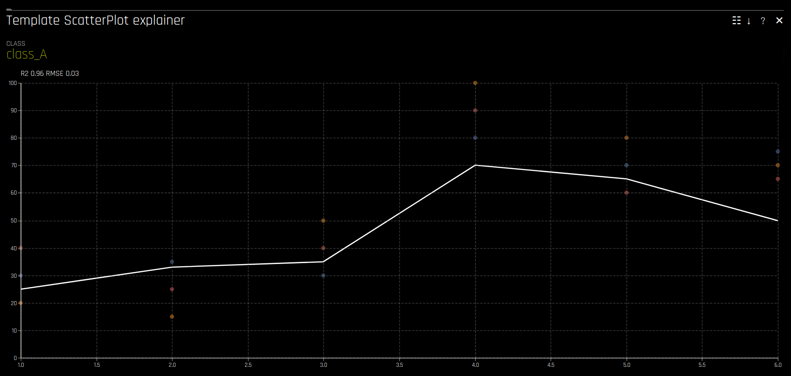

**Template** explainer:

* [template_scatter_plot_explainer.py](https://github.com/h2oai/driverlessai-recipes/blob/master/explainers/explainers/templates/template_scatter_plot_explainer.py)

**Custom Explainers API**

* explanations:
   * `GlobalScatterPlotExplanation`
* representations/formats:
   * `GlobalScatterPlotJSonFormat`

Example of the server-side **filesystem** directory structure:

```
.
├── global_scatter_plot
│   ├── application_json
│   │   ├── explanation.json
│   │   ├── scatter_class_A.json
│   │   ├── scatter_class_B.json
│   │   └── scatter_class_C.json
│   └── ...
├── log
│   └── ...
└── work
    └── ...
```

**Index file** `explanation.json`:

```json
{
	"files": {
		"class_A": "scatter_class_A.json",
		"class_B": "scatter_class_B.json",
		"class_C": "scatter_class_C.json"
	},
	"documentation": "Scatter plot explainer..."
}
```

* `files` dictionary key is **class name**, value is **file name**

**Data file(s)** per per-class/cluster:

```
{
    data: [
        {
            rowId: num,
	        responseVariable: num,
            limePred: num,
            modelPred: num,
            actual: num,
            reasonCode: [
                {
                    label: str,
                    value: num,
                }
            ]
        }
    ],
    bias: str,
    clusterName: str,
    R2: num,
    RMSE: num,
}
```

- contains scatter plot data per class (per-cluster):
   - `clusterName` - name of cluster or just `global` for global value
   - `data` value (list):
       - `rowId` - unique row ID
       - `responseVariable` - response variable value
       - `limePred` - LIME prediction value
       - `modelPred` - model prediction value
       - `actual` - actual value
       - `reasonCode ` reason code (list)
          - `label` - feature's name
          - `value` - feature's value
   - `bias` - R2 value
   - `R2` - R2 value
   - `RMSE` - RMSE value

For example:

```
{
{
	"bias": 0.15,
	"data": [{
		"rowId": 1,
		"responseVariable": 25,
		"limePred": 20,
		"modelPred": 30,
		"actual": 40
	}, {
		"rowId": 2,
		"responseVariable": 33,
		"limePred": 15,
		"modelPred": 35,
		"actual": 25
	}, {
    ...
```

[Open in Vega editor.](https://vega.github.io/editor/#/url/vega/N4IgJAzgxgFgpgWwIYgFwhgF0wBwqgegIDc4BzJAOjIEtMYBXAI0poHsDp5kTykSArJQBWENgDsQAGhAATONABONHJnaT0AQQAE0JNjiLtOADZtM2gO50Y2zIrjjZ2kzXFxtUJCagMT+uGdiGiRtBghDAFooCQAzGjIGRSQmEw8HMgcICHVtBDh6NlkISmkQHCRZWTcyNAEZa1l6OoAGFpl4BKxW9pAkBkw2HIAvODQQeMwypiQoAGtMtgYncdTZubKcsnFvCDQAbVAd-PG3eQAPABEAsokD0DhScUw99AQliPfSMoYcWRv0G5SIpMAAKADk53BUk8-gQOFB51BAEoYe0rDQmjBkciQABfAC6hJk-0wKFQhxAxzG6DJqTGMmI3gYCnuIEUbEsAElZGgAIwyLI4CQRABqSGUKTSaAATPUQK58gAFBy81Ay3rveQmFWBNAAZl6s0wDG8aAALC08VJQBzuWqZYKFMLxGKJSF6Qb9TJFXBdWq+fKtXAdaqDfLjaaTLKBNbbZyeQanRAXW7JZ7UPr5b7-a0ZMHQ3rM0aoCazahLXH2Qm1ebk6m4OL09LUAB2Xo5sOoPltfNFEO51AADhLZejqAAnFabdX7XV6yLG+6pTSAGzZmjKrsjvvawftmSR8ur6fxueoVcL11L5s0gQdzd+rsHkAF-cR0tRtDr4kgexIV1YjYRQEDZTAAE8cBpCY2BMXkZHiENigOV9+0LeCFUfXND0-M0iXwmQ9DSV5KWpcZziIhk-0g6DXHcCUylkNhkDcNBQFJck-xXMpELg8Y7UTa12QAshoMaZpBSWFZUHsFkZFGDk0FiXY4CrMj0HAyiyggqDxjouAGJJZikFY1B2P0Ti6WlBCaCQkjMK3PVdwHMMcLHEAiUFEToM6Mhukk5Y1VkuB5MMNg0GCtSkBOdAYjMRRtJo8ZgOqHZoyMliNHMslxisqjeLVEA5jgcD8S88RRPGLxMHIYDSt-JBzlZClQGA2znlWcxBlAwivBbEAKL6qi2FiWIIimbt5SYzKAGFYOA8ZLBgOgqOmkyNGCn0UhDOb4sW5aarK1rlEcCaFTgWIpl67xoM0obblG8b+XlICQP0cY9gy9bdoW9AlpWxjjNMzaFW2kwfoSv6DrGX9kEUOYSNAHToIgcCECYWCeI5UCzLkCzcu4oTHBieQ2JAU7DDJkYaVAJkTBZVohPiExx1ALTYvmhKbKQ8ZivqoTflJGmBqp+70EGm6eNsvj0AE3khNK3H2ZAO7Je5mWQDphmmZoFmAHkKigOhFdp5kaRaShY3ks44HOMmtfNvEhJgNhgTJ5mTAN2Zjfts3+SE4Ybbt3GHf9p2q2RvS3Hy7GyY4gnPSJ8QSeFwWAVANwasUYV-EOkO-fQfSGKE6nffpx2ZGDtmxYGrT1cKuWypV0XJY0uuJmlhvnUXJsPWlIS2ENn38-LtALatkBA6cW2y4Z1ArWd13KdxwfvYg2eaT5AOg43sOnZnSPZb8Kjif7Mm07z0Aq5AZWJesm+EjS05p6uG4ZBGsaCjHy2Fd3+eFZlO7TuZNFi-HGL5bo+8b72DYMVP+HcHBMGUPMfE4ciRAA)

---

**Local explanation** not supported.
# Best Practices

## Performance
Performance best practices:

* Use fast and efficient data manipulation tools like `data.table`, `sklearn`, `numpy` or `pandas` instead of Python lists, for-loops etc.
* Use disk sparingly, delete temporary files as soon as possible.
* Use memory sparingly, delete objects when no longer needed.
## Safety
Safety best practices:

* Driverless AI automatically performs basic acceptance tests for all custom recipes unless disabled.
* More information in the FAQ.
## Security
Security best practices:

* Recipes are meant to be built by people you trust and each recipe should be code-reviewed before going to production.
* Assume that a user with access to Driverless AI has access to the data inside that instance.
  * Apart from securing access to the instance via private networks, various methods of [authentication](http://docs.h2o.ai/driverless-ai/latest-stable/docs/userguide/authentication.html) are possible. Local authentication provides the most control over which users have access to Driverless AI.
  * Unless the `config.toml` setting `enable_dataset_downloading=false` is set, an authenticated user can download all imported datasets as .csv via direct APIs.
* When recipes are enabled (`enable_custom_recipes=true`, the default), be aware that:
  * The code for the recipes runs as the same native Linux user that runs the Driverless AI application.
    * Recipes have explicit access to all data passing through the transformer/model/scorer API
    * Recipes have implicit access to system resources such as disk, memory, CPUs, GPUs, network, etc.
  * A H2O-3 Java process is started in the background, for use by all recipes using H2O-3. Anyone with access to the Driverless AI instance can browse the file system, see models and data through the H2O-3 interface.

* Best ways to control access to Driverless AI and custom recipes:
  * Control access to the Driverless AI instance
  * Use local authentication to specify exactly which users are allowed to access Driverless AI
  * Run Driverless AI in a Docker container, as a certain user, with only certain ports exposed, and only certain mount points mapped
  * To disable all recipes: Set `enable_custom_recipes=false` in the config.toml, or add the environment variable `DRIVERLESS_AI_ENABLE_CUSTOM_RECIPES=0` at startup of Driverless AI. This will disable all custom transformers, models and scorers.
  * To disable new recipes: To keep all previously uploaded recipes enabled and disable the upload of any new recipes, set `enable_custom_recipes_upload=false` or `DRIVERLESS_AI_ENABLE_CUSTOM_RECIPES_UPLOAD=0` at startup of Driverless AI.
## Versioning
There is **no** Driverless AI BYOR recipe versioning API. 

To deploy new recipe **version** (while you keep the previous one) change:

* recipe **class name**
* recipe **display name** (optional)

For example from:

```python
class ExampleVersionExplainer_v2_0(CustomExplainer):

    _display_name = "Explainer v2.0"
    ...
```

... to:

```python
class ExampleVersionExplainer_v2_1(CustomExplainer):

    _display_name = "Explainer v2.1"
    ...
```

This will create a new explainer with save new name and both explainer versions may coexist.
# Explainer Examples
Examples of simple explainers which demonstrate explainer 
features.

Deploy and run example explainers as described in [Deploy](#deploy) and [Run](#run) sections or [Hello world!](#hello-world) example.
## Hello world!
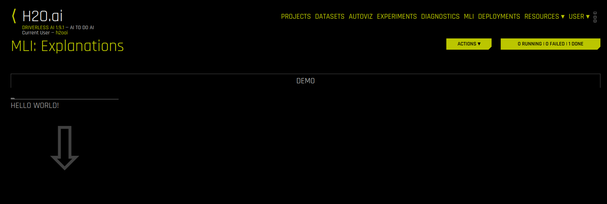

`Hello, World!` explainer is example of the simplest explainer.

```python
from h2oaicore.mli.oss.byor.core.explainers import (
    CustomExplainer,
)
from h2oaicore.mli.oss.byor.core.explanations import WorkDirArchiveExplanation


class ExampleHelloWorldExplainer(CustomExplainer):

    _display_name = "Hello, World!"
    _description = "This is 'Hello, World!' explainer example."
    _regression = True
    _explanation_types = [WorkDirArchiveExplanation]

    def __init__(self):
        CustomExplainer.__init__(self)

    def explain(self, X, y=None, explanations_types=None, **kwargs) -> list:
        explanation = self.create_explanation_workdir_archive(
            display_name=self.display_name, display_category="Demo"
        )

        return [explanation]
```

To try `Hello world` example:

1. store **source code** of the explainer to `hello_world_explainer.py` file
1. **upload** explainer file as described in [Deploy](#deploy) section
1. **run** explainer as described in [Run](#run) section:
    - choose a **regression** model (note that explainer declares that it explains regression models with `_regression = True`)
    - choose `Hello, World!` explainer in **selected** recipes listing **only** (uncheck all others)
    - click `LAUNCH MLI`
1. once explainer run finishes, you can get it's **result** - zip archive as described in [Get](#get) section.
    - note that `display_category` parameter is used to name tab in UI
    - note that `display_name` parameter is used to name tile in UI

Archive representation created by the explainer contains its working directory content (which is empty in this case)
Anyway this is simplest way how to get any explainer artifact, computation results or representations created by 
the explainer if their visualization is not needed.
## Logging Example
```python
from h2oaicore.mli.oss.byor.core.explainers import (
    CustomExplainer,
)
from h2oaicore.mli.oss.byor.core.explanations import WorkDirArchiveExplanation


class ExampleLoggingExplainer(CustomExplainer):

    _display_name = "Example Logging Explainer"
    _description = "This is logging explainer example."
    _regression = True
    _explanation_types = [WorkDirArchiveExplanation]

    def __init__(self):
        CustomExplainer.__init__(self)

    def setup(self, model, persistence, **kwargs):
        CustomExplainer.setup(self, model, persistence, **kwargs)

        self.logger.info(f"{self.display_name} explainer initialized")

    def explain(self, X, y=None, explanations_types=None, **kwargs) -> list:
        self.logger.debug(f"explain() method invoked with args: {kwargs}")

        if not explanations_types:
            self.logger.warning(
                f"Explanation types to be returned by {self.display_name} not specified"
            )

        try:
            return [
                self.create_explanation_workdir_archive(
                    display_name=self.display_name, display_category="Demo"
                )
            ]
        except Exception as ex:
            self.logger.error(
                f"Explainer '{ExampleLoggingExplainer.__name__}' failed with: {ex}"
            )
            raise ex
```
## EDA Example
```python
from h2oaicore.mli.oss.byor.core.explainers import (
    CustomExplainer,
)
from h2oaicore.mli.oss.byor.core.explanations import WorkDirArchiveExplanation


class ExampleEdaExplainer(CustomExplainer):

    _display_name = "Example Dataset Explainer"
    _description = "This is Explanatory Data Analysis explainer example."
    _regression = True
    _explanation_types = [WorkDirArchiveExplanation]

    def __init__(self):
        CustomExplainer.__init__(self)

    def setup(self, model, persistence, **kwargs):
        CustomExplainer.setup(self, model, persistence, **kwargs)

    def explain(self, X, y=None, explanations_types=None, **kwargs) -> list:
        self.logger.debug("explain() method invoked with dataset:")
        self.logger.debug(f"  type:    {type(X)}")
        self.logger.debug(f"  shape:   {X.shape}")
        self.logger.debug(f"  columns: {X.names}")
        self.logger.debug(f"  types:   {X.stypes}")
        self.logger.debug(f"  unique:  {X.nunique()}")
        self.logger.debug(f"  max:     {X.max()}")
        self.logger.debug(f"  min:     {X.min()}")

        return [
            self.create_explanation_workdir_archive(
                display_name=self.display_name, display_category="Demo"
            )
        ]
```
## Score Example
```python
from h2oaicore.mli.oss.byor.core.explainers import (
    CustomDaiExplainer,
    CustomExplainer,
)
from h2oaicore.mli.oss.byor.core.explanations import WorkDirArchiveExplanation


class ExampleScoreExplainer(CustomExplainer, CustomDaiExplainer):

    _display_name = "Example Score Explainer"
    _description = (
        "This is explainer example which demonstrates how to get model predict "
        "method and use it to score dataset."
    )
    _regression = True
    _explanation_types = [WorkDirArchiveExplanation]

    def __init__(self):
        CustomExplainer.__init__(self)
        CustomDaiExplainer.__init__(self)

    def setup(self, model, persistence, **e_params):
        CustomExplainer.setup(self, model, persistence, **e_params)
        CustomDaiExplainer.setup(self, **e_params)

    def explain(self, X, y=None, explanations_types=None, **kwargs) -> list:
        # prepare 1st row of the dataset with features used by the model
        df = X[:1, self.used_features]
        self.logger.info(f"Dataset to score: {df}")

        # model predict method
        prediction = self.model.predict_method(df)
        self.logger.info(f"Prediction     : {prediction}")

        return [
            self.create_explanation_workdir_archive(
                display_name=self.display_name, display_category="Demo"
            )
        ]
```
## Parameters Example
```python
from h2oaicore.mli.oss.byor.core.explainers import (
    CustomDaiExplainer,
    CustomExplainer,
    CustomExplainerParam,
)
from h2oaicore.mli.oss.byor.core.explanations import WorkDirArchiveExplanation
from h2oaicore.mli.oss.byor.explainer_utils import CustomExplainerArgs
from h2oaicore.mli.oss.commons import ExplainerParamType


class ExampleParamsExplainer(CustomExplainer, CustomDaiExplainer):

    PARAM_ROWS_TO_SCORE = "rows_to_score"

    _display_name = "Example Params Explainer"
    _description = (
        "This explainer example shows how to define explainer parameters."
    )
    _regression = True
    _parameters = [
        CustomExplainerParam(
            param_name=PARAM_ROWS_TO_SCORE,
            description="The number of dataset rows to be scored by explainer.",
            param_type=ExplainerParamType.int,
            default_value=1,
            src=CustomExplainerParam.SRC_EXPLAINER_PARAMS,
        ),
    ]
    _explanation_types = [WorkDirArchiveExplanation]

    def __init__(self):
        CustomExplainer.__init__(self)
        CustomDaiExplainer.__init__(self)

        self.args = None

    def setup(self, model, persistence, **e_params):
        CustomExplainer.setup(self, model, persistence, **e_params)
        CustomDaiExplainer.setup(self, **e_params)

        # resolve explainer parameters to instance attributes
        self.args = CustomExplainerArgs(ExampleParamsExplainer._parameters)
        self.args.resolve_params(
            explainer_params=CustomExplainerArgs.json_str_to_dict(
                self.explainer_params_as_str
            )
        )

    def explain(self, X, y=None, explanations_types=None, **kwargs) -> list:
        # use parameter
        rows = self.args.get(self.PARAM_ROWS_TO_SCORE)

        df = X[:rows, self.used_features]
        prediction = self.model.predict_method(df)
        self.logger.info(
            f"Predictions of dataset with shape {df.shape}: {prediction}"
        )
        return [
            self.create_explanation_workdir_archive(
                display_name=self.display_name, display_category="Demo"
            )
        ]
```
## Compatibility Example
```python
from typing import Optional

from h2oaicore.messages import CommonExplainerParameters
from h2oaicore.mli.oss.byor.core.explainers import (
    CustomDaiExplainer,
    CustomExplainer,
)
from h2oaicore.mli.oss.byor.core.explanations import WorkDirArchiveExplanation


class ExampleCompatibilityCheckExplainer(CustomExplainer, CustomDaiExplainer):

    _display_name = "Example Compatibility Check Explainer"
    _description = "This is explainer with compatibility check example."
    _regression = True
    _explanation_types = [WorkDirArchiveExplanation]

    def __init__(self):
        CustomExplainer.__init__(self)
        CustomDaiExplainer.__init__(self)

    def check_compatibility(
        self,
        params: Optional[CommonExplainerParameters] = None,
        **explainer_params,
    ) -> bool:
        CustomExplainer.check_compatibility(self, params, **explainer_params)
        CustomDaiExplainer.check_compatibility(self, params, **explainer_params)

        # explainer can explain only dataset with less than 1M rows (without sampling)
        if self.dataset_entity.row_count > 1_000_000:
            # not supported
            return False
        return True

    def explain(self, X, y=None, explanations_types=None, **kwargs) -> list:
        return [
            self.create_explanation_workdir_archive(
                display_name=self.display_name, display_category="Demo"
            )
        ]
```
## Persistence Example
```python
from h2oaicore.mli.oss.byor.core.explainers import (
    CustomExplainer,
)
from h2oaicore.mli.oss.byor.core.explanations import WorkDirArchiveExplanation


class ExamplePersistenceExplainer(CustomExplainer):

    _display_name = "Example Persistence Explainer"
    _description = (
        "This is explainer example which demonstrates how to use persistence object"
        "in order to access explainer file system (sandbox) - working, explanations "
        "and MLI directories."
    )
    _regression = True
    _explanation_types = [WorkDirArchiveExplanation]

    def __init__(self):
        CustomExplainer.__init__(self)

    def setup(self, model, persistence, **kwargs):
        CustomExplainer.setup(self, model, persistence, **kwargs)

    def explain(self, X, y=None, explanations_types=None, **kwargs) -> list:
        # use self.persistence object to get file system paths
        self.logger.info(f"Explainer MLI dir: {self.persistence.base_dir}")
        self.logger.info(
            f"Explainer dir: {self.persistence.get_explainer_dir()}"
        )

        # save 1st row of dataset to work directory and prepare work directory archive
        df_head = X[:1, :]
        df_head.to_csv(
            self.persistence.get_explainer_working_file("dataset_head.csv")
        )

        return [
            self.create_explanation_workdir_archive(
                display_name=self.display_name, display_category="Demo"
            )
        ]
```
## Custom Explanation Example
```python
from h2oaicore.mli.oss.byor.core.explainers import (
    CustomDaiExplainer,
    CustomExplainer,
)
from h2oaicore.mli.oss.byor.core.explanations import CustomExplanation
from h2oaicore.mli.oss.byor.core.representations import (
    TextCustomExplanationFormat,
)


class MyCustomExplanation(CustomExplanation):
    """Example of a user defined explanation type."""

    _explanation_type = "user-guide-explanation-example"
    _is_global = True

    def __init__(
        self, explainer, display_name: str = None, display_category: str = None
    ) -> None:
        CustomExplanation.__init__(
            self,
            explainer=explainer,
            display_name=display_name,
            display_category=display_category,
        )

    def validate(self) -> bool:
        return self._formats is not None


class ExampleCustomExplanationExplainer(CustomExplainer, CustomDaiExplainer):

    _display_name = "Example Custom Explanation Explainer"
    _description = (
        "Explainer example which shows how to define custom explanation."
    )
    _regression = True
    _explanation_types = [TextCustomExplanationFormat]

    def __init__(self):
        CustomExplainer.__init__(self)
        CustomDaiExplainer.__init__(self)

    def setup(self, model, persistence, **e_params):
        CustomExplainer.setup(self, model, persistence, **e_params)
        CustomDaiExplainer.setup(self, **e_params)

    def explain(self, X, y=None, explanations_types=None, **kwargs) -> list:
        df = X[:1, self.used_features]
        prediction = self.model.predict_method(df)

        # create CUSTOM explanation
        explanation = MyCustomExplanation(
            explainer=self,
            display_name="Custom Explanation Example",
            display_category="Example",
        )
        # add a text format to CUSTOM explanation
        explanation.add_format(
            TextCustomExplanationFormat(
                explanation=explanation,
                format_data=f"Prediction is: {prediction}",
                format_file=None,
            )
        )

        return [explanation]
```

`ExampleCustomExplanationExplainer` explainer demonstrates how to create a new explanation type.

To try custom explanation explainer:

1. store **source code** of the explainer to a file
1. **upload** explainer file as described in [Deploy](#deploy) section
1. **run** explainer as described in [Run](#run) section:
    - choose a **regression** model
    - choose `Example Custom Explanation Explainer` explainer in **selected** recipes listing **only** (uncheck all others)
    - click `LAUNCH MLI`
1. once explainer run finishes, you can get it's **result** as follows:
    - click `0 RUNNING | 0 FAILED | 1 DONE` button
    - however over `Example Custom Explanation Explainer` row and click `SNAPSHOT` button to download explaner data snapshot

The content of the snapshot archive is shown below - not how are the paths and names created based on the
explanation and format classes:

```
explainer_..._ExampleCustomExplanationExplainer_<UUID>
.
├── global_user_guide_explanation_example
│   ├── text_plain
│   │   └── explanation.txt
│   └── text_plain.meta
├── log
│   ├── explainer_run_1f16a4ce-5a62-11eb-979d-e86a64888647_anonymized.log
│   ├── explainer_run_1f16a4ce-5a62-11eb-979d-e86a64888647.log
│   └── logger.lock
├── result_descriptor.json
└── work
    └── EXPLAINER_DONE
```
## DAI Explainer Metadata Example
```python
from h2oaicore.mli.oss.byor.core.explainers import (
    CustomDaiExplainer,
    CustomExplainer,
)
from h2oaicore.mli.oss.byor.core.explanations import WorkDirArchiveExplanation


class ExampleMetaAndAttrsExplainer(CustomExplainer, CustomDaiExplainer):

    _display_name = "Example DAI Explainer Metadata and Attributes"
    _description = (
        "This explainer example prints explainer metadata, instance attributes and "
        "setup() method parameters."
    )
    _regression = True
    _explanation_types = [WorkDirArchiveExplanation]

    def __init__(self):
        CustomExplainer.__init__(self)
        CustomDaiExplainer.__init__(self)

    def setup(self, model, persistence, **e_params):
        CustomExplainer.setup(self, model, persistence, **e_params)
        CustomDaiExplainer.setup(self, **e_params)

        self.logger.info("setup() method parameters:")
        self.logger.info(f"    {e_params}")

        self.logger.info("explainer metadata:")
        self.logger.info(f"    display name: {self._display_name}")
        self.logger.info(f"    description: {self._description}")
        self.logger.info(f"    keywords: {self._keywords}")
        self.logger.info(f"    IID: {self._iid}")
        self.logger.info(f"    TS: {self._time_series}")
        self.logger.info(f"    image: {self._image}")
        self.logger.info(f"    regression: {self._regression}")
        self.logger.info(f"    binomial: {self._binary}")
        self.logger.info(f"    multinomial: {self._multiclass}")
        self.logger.info(f"    global: {self._global_explanation}")
        self.logger.info(f"    local: {self._local_explanation}")
        self.logger.info(f"    explanation types: {self._explanation_types}")
        self.logger.info(
            f"    optional e. types: {self._optional_explanation_types}"
        )
        self.logger.info(f"    parameters: {self._parameters}")
        self.logger.info(f"    not standalone: {self._requires_predict_method}")
        self.logger.info(f"    Python deps: {self._modules_needed_by_name}")
        self.logger.info(f"    explainer deps: {self._depends_on}")
        self.logger.info(f"    priority: {self._priority}")

        self.logger.info("explainer instance attributes:")
        self.logger.info(f"    explainer params: {self.explainer_params}")
        self.logger.info(f"    common params: {self.params}")
        self.logger.info(f"    DAI params: {self.dai_params}")
        self.logger.info(f"    explainer deps: {self.explainer_deps}")
        self.logger.info(f"    model with predict method: {self.model}")
        self.logger.info(f"    features used by model: {self.used_features}")
        self.logger.info(f"    target labels: {self.labels}")
        self.logger.info(f"    number of target labels: {self.num_labels}")
        self.logger.info(f"    persistence: {self.persistence}")
        self.logger.info(f"    MLI key: {self.mli_key}")
        self.logger.info(f"    DAI username: {self.dai_username}")
        self.logger.info(f"    model entity: {self.model_entity}")
        self.logger.info(f"    dataset entity: {self.dataset_entity}")
        self.logger.info(
            f"    validation dataset entity: {self.validset_entity}"
        )
        self.logger.info(f"    test dataset entity: {self.testset_entity}")
        self.logger.info(f"    sanitization map: {self.sanitization_map}")
        self.logger.info(f"    enable MOJO: {self.enable_mojo}")
        self.logger.info(f"    Driverless AI configuration: {self.config}")

    def explain(self, X, y=None, explanations_types=None, **kwargs) -> list:
        return [
            self.create_explanation_workdir_archive(
                display_name=self.display_name, display_category="Demo"
            )
        ]
```

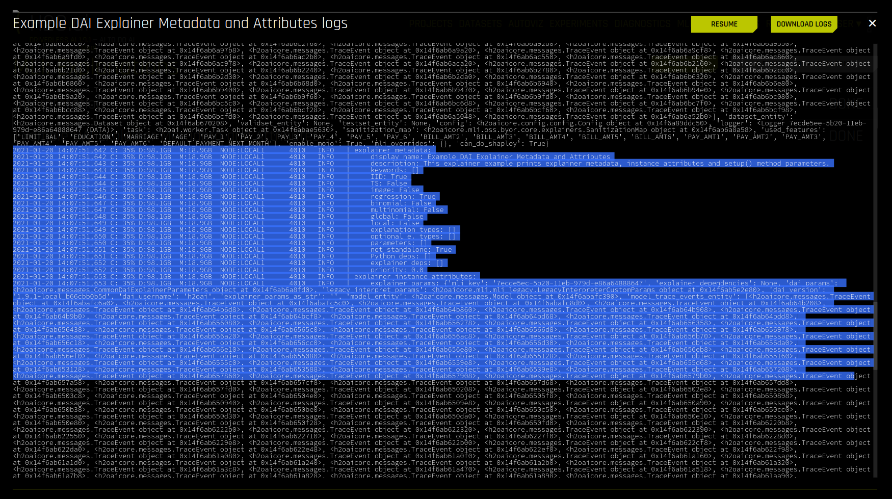
## Morris SA example
Putting MLI BYOR examples together: Morris Sensitivity Analysis explainers demonstrates how to use a 3rd party library as MLI BYOR recipe to understand Driverless AI models.

```python
from functools import partial

import datatable as dt
import numpy as np
import pandas as pd

from h2oaicore.mli.oss.byor.core.explainers import (
    CustomDaiExplainer,
    CustomExplainer,
)
from h2oaicore.mli.oss.byor.core.explanations import GlobalFeatImpExplanation
from h2oaicore.mli.oss.byor.core.representations import (
    GlobalFeatImpJSonDatatableFormat,
    GlobalFeatImpJSonFormat,
)
from h2oaicore.mli.oss.byor.explainer_utils import clean_dataset


# Explainer MUST extend abstract CustomExplainer class to be discovered and
# deployed. In addition it inherits common metadata and (default) functionality. The
# explainer must implement fit() and explain() methods.
#
# Explainer CAN extend CustomDaiExplainer class if it will run on Driverless AI server
# and use experiments. CustomDaiExplainer class provides easy access/handle to the
# dataset and model (metadata and artifacts), filesystem, ... and common logic.
class MorrisSensitivityLeExplainer(CustomExplainer, CustomDaiExplainer):
    """InterpretML: Morris sensitivity (https://github.com/interpretml/interpret)"""

    # explainer display name (used e.g. in UI explainer listing)
    _display_name = "Morris Sensitivity Analysis"
    # explainer description (used e.g. in UI explanations help)
    _description = (
        "Morris sensitivity analysis explainer provides Morris SA based feature "
        "importance which is a measure of the contribution of an input variable "
        "to the overall predictions of the Driverless AI model. In applied "
        "statistics, the Morris method for global sensitivity analysis is a so-called "
        "one-step-at-a-time method (OAT), meaning that in each run only one "
        "input parameter is given a new value."
        "This Morris sensitivity analysis explainer is based based on InterpretML"
        "library (http//interpret.ml)."
    )
    # declaration of supported experiments: regression / binary / multiclass
    _regression = True
    _binary = True
    # declaration of provided explanations: global, local or both
    _global_explanation = True
    # declaration of explanation types this explainer creates e.g. feature importance
    _explanation_types = [GlobalFeatImpExplanation]
    # Python package dependencies (can be installed using pip)
    _modules_needed_by_name = ["gevent==1.5.0", "interpret==0.1.20"]

    # explainer constructor must not have any required parameters
    def __init__(self):
        CustomExplainer.__init__(self)
        CustomDaiExplainer.__init__(self)
        self.cat_variables = None
        self.mcle = None

    # setup() method is used to initialize the explainer based on provided parameters
    # which are passed from client/UI. See parent classes setup() methods docstrings
    # and source to check the list of instance fields which are initialized for the
    # explainer
    def setup(self, model, persistence, key=None, params=None, **e_params):
        CustomExplainer.setup(self, model, persistence, key, params, **e_params)
        CustomDaiExplainer.setup(self, **e_params)

    # abstract fit() method must be implemented - its purpose is to pre-compute
    # any artifacts e.g. surrogate models, to be used by explain() method
    def fit(self, X: dt.Frame, y: dt.Frame = None, **kwargs):
        # nothing to pre-compute
        return self

    # explain() method is responsible for the creation of the explanations
    def explain(
        self, X, y=None, explanations_types: list = None, **kwargs
    ) -> list:
        # 3rd party Morris SA library import
        from interpret.blackbox import MorrisSensitivity

        # DATASET: categorical features encoding (for 3rd party libraries which
        # support numeric features only), rows w/ missing values filtering, ...
        X = X[:, self.used_features] if self.used_features else X
        x, self.cat_variables, self.mcle, _ = clean_dataset(
            frame=X.to_pandas(),
            le_map_file=self.persistence.get_explainer_working_file("mcle"),
            logger=self.logger,
        )

        # PREDICT FUNCTION: Driverless AI scorer -> library compliant predict function
        def predict_function(
            pred_fn, col_names, cat_variables, label_encoder, X
        ):
            X = pd.DataFrame(X.tolist(), columns=col_names)

            # categorical features inverse label encoding used in case of 3rd party
            # libraries which support numeric only
            if label_encoder:
                X[cat_variables] = X[cat_variables].astype(np.int64)
                label_encoder.inverse_transform(X)

            # score
            preds = pred_fn(X)

            # scoring output conversion to the format expected by 3rd party library
            if isinstance(preds, pd.core.frame.DataFrame):
                preds = preds.to_numpy()
            if preds.ndim == 2:
                preds = preds.flatten()
            return preds

        predict_fn = partial(
            predict_function,
            self.model.predict_method,
            self.used_features,
            self.cat_variables,
            self.mcle,
        )

        # CALCULATION of the Morris SA explanation
        sensitivity: MorrisSensitivity = MorrisSensitivity(
            predict_fn=predict_fn, data=x, feature_names=list(x.columns)
        )
        morris_explanation = sensitivity.explain_global(name=self.display_name)

        # NORMALIZATION of proprietary Morris SA library data to explanation w/
        # Grammar of MLI format for the visualization in Driverless AI UI
        explanations = [self._normalize_to_gom(morris_explanation)]

        # explainer MUST return declared explanation(s) (_explanation_types)
        return explanations

    #
    # optional NORMALIZATION to Grammar of MLI
    #
    """
        explainer_morris_sensitivity_explainer_..._MorrisSensitivityExplainer_<UUID>
        ├── global_feature_importance
        │   ├── application_json
        │   │   ├── explanation.json
        │   │   └── feature_importance_class_0.json
        │   └── application_vnd_h2oai_json_datatable_jay
        │       ├── explanation.json
        │       └── feature_importance_class_0.jay
        ├── log
        │   ├── explainer_job.log
        │   └── logger.lock
        └── work
    """

    # Normalization of the data to the Grammar of MLI defined format. Normalized data
    # can be visualized using Grammar of MLI UI components in Driverless AI web UI.
    #
    # This method creates explanation (data) and its representations (JSon, datatable)
    def _normalize_to_gom(self, morris_explanation) -> GlobalFeatImpExplanation:
        # EXPLANATION
        explanation = GlobalFeatImpExplanation(
            explainer=self,
            # display name of explanation's tile in UI
            display_name=self.display_name,
            # tab name where to put explanation's tile in UI
            display_category=GlobalFeatImpExplanation.DISPLAY_CAT_CUSTOM,
        )

        # FORMAT: explanation representation as JSon+datatable (JSon index file which
        # references datatable frame for each class)
        jdf = GlobalFeatImpJSonDatatableFormat
        # data normalization: 3rd party frame to Grammar of MLI defined frame
        # conversion - see GlobalFeatImpJSonDatatableFormat docstring for format
        # documentation and source for helpers to create the representation easily
        explanation_frame = dt.Frame(
            {
                jdf.COL_NAME: morris_explanation.data()["names"],
                jdf.COL_IMPORTANCE: list(morris_explanation.data()["scores"]),
                jdf.COL_GLOBAL_SCOPE: [True]
                * len(morris_explanation.data()["scores"]),
            }
        ).sort(-dt.f[jdf.COL_IMPORTANCE])
        # index file (of per-class data files)
        (
            idx_dict,
            idx_str,
        ) = GlobalFeatImpJSonDatatableFormat.serialize_index_file(
            ["global"],
            doc=MorrisSensitivityLeExplainer._description,
        )
        json_dt_format = GlobalFeatImpJSonDatatableFormat(explanation, idx_str)
        json_dt_format.update_index_file(
            idx_dict, total_rows=explanation_frame.shape[0]
        )
        # data file
        json_dt_format.add_data_frame(
            format_data=explanation_frame,
            file_name=idx_dict[jdf.KEY_FILES]["global"],
        )
        # JSon+datatable format can be added as explanation's representation
        explanation.add_format(json_dt_format)

        # FORMAT: explanation representation as JSon
        #
        # Having JSon+datatable formats it's easy to get other formats like CSV,
        # datatable, ZIP, ... using helpers - adding JSon representation:
        explanation.add_format(
            explanation_format=GlobalFeatImpJSonFormat.from_json_datatable(
                json_dt_format
            )
        )

        return explanation
```

See https://github.com/h2oai/driverlessai-recipes/tree/master/explainers for more Driverless AI explainer recipe examples.
## Explainer Templates
If you want to create a new explainer, then you can use templates which were prepared for every [Grammar of MLI](#grammar-of-mli) explanation type:

* [decision tree](https://github.com/h2oai/driverlessai-recipes/blob/master/explainers/explainers/templates/template_dt_explainer.py)
* [feature importance](https://github.com/h2oai/driverlessai-recipes/blob/master/explainers/explainers/templates/template_featimp_explainer.py)
* [Markdown report](https://github.com/h2oai/driverlessai-recipes/blob/master/explainers/explainers/templates/template_md_explainer.py) with...
   * [Pandas images](https://github.com/h2oai/driverlessai-recipes/blob/master/explainers/explainers/templates/template_md_explainer.py)
   * [Vega diagrams](https://github.com/h2oai/driverlessai-recipes/blob/master/explainers/explainers/templates/template_md_vega_explainer.py)
   * [feature importance summary chart](https://github.com/h2oai/driverlessai-recipes/blob/master/explainers/explainers/templates/template_md_featimp_summary_explainer.py)
* [PD/ICE](https://github.com/h2oai/driverlessai-recipes/blob/master/explainers/explainers/templates/template_pd_explainer.py)
* [scatter plot](https://github.com/h2oai/driverlessai-recipes/blob/master/explainers/explainers/templates/template_scatter_plot_explainer.py)
* ...

Check [templates/](https://github.com/h2oai/driverlessai-recipes/tree/master/explainers/explainers/templates) folder in Driverless AI recipes GitHub repository and download source code from there.
# Appendices

## Explainer Python API
_[...Explainer recipe Python API (apidoc)...]_
## Python Client API Jupyter Notebook
[Python Client API Jupyter Notebook](https://github.com/h2oai/driverlessai-recipes/blob/master/explainers/notebooks/mli-byor.ipynb) contains end to end scenario which demonstrates how to use Driverless AI **RPC API** [client](#python-client-api-reference) to upload, filter, run, debug and get explainer results.
## Python Client API reference
Driverless AI provides RPC API which can be accessed
using **generated** Python Client. This section is
RPC API procedures reference.

```
ExplanationDescriptor
  explanation_type str
  name str
  category str
  scope str
  has_local str
  formats str[]

ExplainerDescriptor
  id str
  name str
  model_types str[]
  can_explain str[]
  explanation_scopes str[]
  explanations ExplanationDescriptor[]
  parameters ConfigItem[]
  keywords str[]

ExplainerRunJob
  progress float
  status int
  error str
  message str
  entity ExplainerDescriptor
  created float
  duration int
  child_explainers_job_keys str[]

ExplainersRunJob
  explainer_job_keys str[]
  mli_key str
  created float
  duration int
  status int
  progress float

CommonExplainerParameters
  target_col str
  weight_col str
  prediction_col str # no model explanation
  drop_cols str[]
  sample_num_rows int # >0 to sample, -1 to skip sampling

CommonDaiExplainerParameters
  common_params CommonExplainerParameters
  model ModelReference
  dataset DatasetReference
  validset DatasetReference
  testset DatasetReference
  use_raw_features bool
  config_overrides str
  sequential_execution bool
  debug_model_errors bool
  debug_model_errors_class str

Explainer
  explainer_id str # explainer ID
  explainer_params str # declared explainer parameters as JSon string

# complete explainers runs descriptor (RPC API)
ExplainersRunSummary
  common_params CommonExplainerParameters
  explainers Explainer[]
  explainer_run_jobs ExplainerRunJob[]

ExplainerJobStatus
    mli_key str
    explainer_job_key str
    explainer_job ExplainerRunJob

create_custom_recipe_from_url str
  url str

upload_custom_recipe_sync CustomRecipe
  file_path str

list_explainers ExplainerDescriptor[]
  experiment_types str[]
  explanation_scopes str[]
  dai_model_key str
  keywords str[]
  explainer_filter FilterEntry[]

list_explainable_models ListModelQueryResponse
  explainer_id str
  offset int
  size int

get_explainer ExplainerDescriptor
  explainer_id str

run_explainers ExplainersRunJob*
  explainers Explainer[] # explainers to run
  params CommonDaiExplainerParameters # common DAI explainer run parameters

run_interpretation_with_explainers ExplainersRunJob*
  explainers Explainer[] # explainers to run
  params CommonDaiExplainerParameters # common DAI explainer run parameters
  interpret_params InterpretParameters

get_explainer_run_job ExplainerRunJob
  explainer_job_key str

abort_explainer_run_jobs void
  mli_key str
  explainer_job_keys str[]

get_explainer_job_status ExplainerJobStatus
    mli_key str
    explainer_job_key str

get_explainer_job_statuses ExplainerJobStatus[]
    mli_key str
    explainer_job_keys str[]

get_explainer_job_keys_by_id str[]
    mli_key str
    explainer_id str

get_explainer_run_log_url_path str
  mli_key str
  explainer_job_key str

list_explainer_results ExplainerDescriptor
  explainer_job_key str

get_explainer_result_url_path str
  mli_key str
  explainer_job_key str
  explanation_type str
  explanation_format str

get_explainer_snapshot_url_path str*
  mli_key str
  explainer_job_key str

FilterEntry
  filter_by str
  value str

get_explainer_result str
  mli_key str
  explainer_job_key str
  explanation_type str
  explanation_format str
  page_offset int
  page_size int
  result_format str
  explanation_filter FilterEntry[]

get_explainer_local_result str
  mli_key str
  explainer_job_key str
  explanation_type str
  explanation_format str
  id_column_name str
  id_column_value str
  page_offset int
  page_size int
  result_format str
  explanation_filter FilterEntry[]
```
## Driverless AI Configuration
Driverless AI administrators can configure server using `config.toml` file located in Driverless AI home directory. Users can use the same configuration keys in **config overrides** (API or UI) to change default server behavior.

MLI BYORs related Driverless AI configuration items:

* `excluded_mli_explainers: list[str]`
    - **Exclude** (problematic) MLI explainers (for all users).
    - To disable an explainer use its ID.

Example:

* To disable Sensitivity Analysis explainer use `h2oaicore.mli.byor.recipes.sa_explainer.SaExplainer` ID.
* Add the following entry to config overrides in **expert settings**:
    * `excluded_mli_explainers=['h2oaicore.mli.byor.recipes.sa_explainer.SaExplainer']`
* Add the following row to the `config.mk`:
    * `excluded_mli_explainers=['h2oaicore.mli.byor.recipes.sa_explainer.SaExplainer']`
* Alternatively export the following shell environment variable:
    * `DRIVERLESS_AI_EXCLUDED_MLI_EXPLAINERS=['h2oaicore.mli.byor.recipes.sa_explainer.SaExplainer']`
# Resources
MLI BYOR documentation:

* [Creating Custom Explainer with MLI BYORs](CREATING_CUSTOM_EXPLAINER_WITH_MLI_BYOR.md) (getting started)

MLI BYOR examples (source):

* Explainers section of [Driverless AI Recipes](https://github.com/h2oai/driverlessai-recipes/tree/master/explainers/explainers) repository
* [Python Client API Jupyter Notebook](https://github.com/h2oai/driverlessai-recipes/blob/master/explainers/notebooks/mli-byor.ipynb)

Libraries and products:

* [Driverless AI](https://www.h2o.ai/products/h2o-driverless-ai/)
* [datatable documentation](https://datatable.readthedocs.io/)
